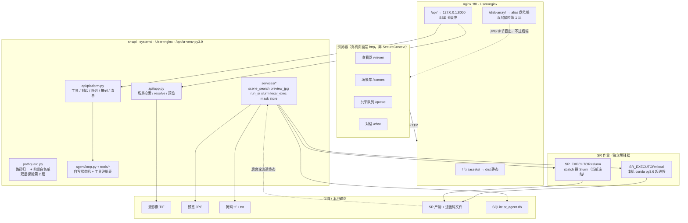
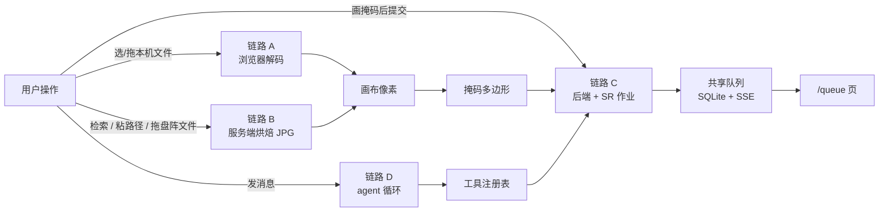
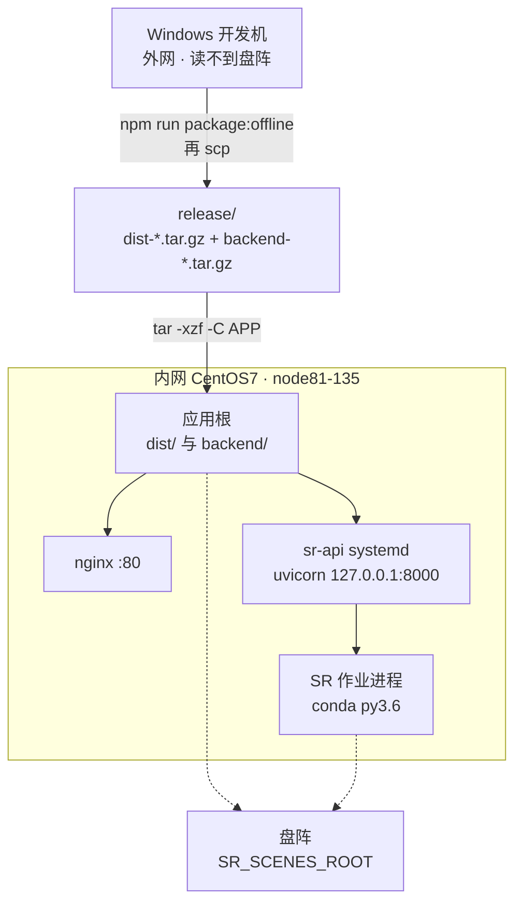

# sr_agent_platform IO 管线与模块交互（io-pipeline 系列）

> 日期：2026-09-23 · 状态：草稿（内容逐条对照当日仓库代码，未跑真机）
>
> **目标读者**：接手部署与运维的人、需要向外部讲清这套系统怎么跑起来的人。
> 前者关心进程边界、路径、权限、环境变量与升级动作；后者关心分层、链路与设计取舍。
>
> **一句话摘要**：这套平台的 IO 一共有四条链路——浏览器读本地影像、浏览器读盘阵场景预览、
> 掩码经后端落到盘阵并驱动一次超分作业、对话驱动工具调用——四条链路各自进出哪些文件、
> 经过哪些进程与模块，本系列逐条拆开。
>
> **阅读顺序**：先看本文件 §2 的分层图与 §3 的四条链路总览建立整体印象，再按需要读分篇。
> 只需要部署与排障的读者，读完 [topology.md](topology.md) 即可，其余四篇是链路细节。
>
> **不覆盖**：`SR_GUI/`（已清空的遗留目录，无源码无入库记录）、`CloudReview_Update_*`
> （独立的云量复核工具，与本平台无调用关系）、`tif_viewer/tif-viewer.html` 与
> `quick-look.html`（仓库根目录的独立单文件查看器，不参与平台构建与部署）。

---

## 1. 本系列与既有文档的分工

本系列是**架构视图**：写分层、链路、模块调用关系、进程与文件边界。
细节不在本系列重复，按下面这张表去查既有文档——避免同一事实两处维护。

| 想查什么 | 去哪 |
|---|---|
| 某一行的烘焙尺寸、拉伸公式、缓存签名的逐字节口径 | [preview-bake-pipeline.md](../preview-bake-pipeline.md) |
| 每个端点的入参、返回、错误码 | [api-contract.md](../../planning/api-contract.md) |
| 部署步骤、升级判定表、Slurm 装什么 | [deploy/README.md](../../../deploy/README.md) |
| SR 算法、调用契约、Windows 移植 | [docs/sr_code/](../../sr_code/) |
| 真机现在是什么状态、下一步做什么 | [current-question.md](../../status/current-question.md) |
| 某个决定或事故的经过 | [timeline-archive.md](../../status/timeline-archive.md) |
| 系统理解前后端（教程口吻，从 0 讲起） | [platform-tutorial.md](../platform-tutorial.md) |

**事实口径**：本系列描述的是**当前仓库代码的行为**，不区分该行为是否已在真机验证过。
凡属「只有单测覆盖」「真机尚未实证」的环节，就地标注，不写进正文的默认前提。
真机实测值与仓库默认值的偏差集中在 [current-question.md](../../status/current-question.md) §6.1。

---

## 2. 分层

三点值得先记住：

- **`/disk-array/` 不经过后端**。盘阵的静态字节由 nginx 直接返回；后端的路径白名单
  只保护 `/api/` 那一路。这是「双层保险」的第一层与第二层（见 [topology.md](topology.md) §4）。
- **两个 Python 解释器平行存在、互不污染**。平台 venv 是 py3.9，SR 生产环境是 py3.6 带
  torch/GDAL。后端不 import SR 的任何模块，只把解释器路径写进批脚本。
- **服务端烘焙与浏览器本地解码是两条独立的路**。盘阵场景一律走服务端烤好的 JPG；
  只有用户从本机选的 TIF 才在浏览器里解码。两条路的常量不共用。

---

## 3. 四条链路

| # | 链路 | 起点 | 终点 | 分篇 |
|---|---|---|---|---|
| A | 本地影像 → 画布 | 用户选/拖本机 TIF | 浏览器画布上的像素 | [browser-io.md](browser-io.md) |
| B | 盘阵场景 → 预览 → 画布 | 场景 id / 盘阵路径 / 拖入文件 | 浏览器画布上的像素 | [scene-io.md](scene-io.md) |
| C | 掩码 → SR 作业 → 队列 | 画布上画完的掩码 | 盘阵产物 + 队列状态 | [sr-io.md](sr-io.md) |
| D | 对话 → 工具调用 | 聊天页或查看器侧舱的一条消息 | 工具副作用 + SSE 帧 | [agent-io.md](agent-io.md) |

链路 A 与 B 的终点相同，区别在**像素从哪来**：A 的像素由浏览器自己解码源 TIF，
B 的像素来自服务端烤好的 JPEG。二者的掩码坐标都换算到**源影像的元数据尺寸**上，
所以两条路画的掩码可以落在同一套坐标里。

链路 D 与链路 C 在**工具注册表**处汇合：会话里调用的 `run_sr` 与队列页提交的作业，
走的是同一份参数归一与同一个任务指纹，因此同参数的作业只会有一行
（见 [agent-io.md](agent-io.md) §4）。

---

## 4. 部署拓扑（速览）

真机是一台 CentOS7 内网机。细节、环境变量全表与升级动作见 [topology.md](topology.md)。

**两个包必须同版本更新**：前端 `dist` 与后端 `backend` 之间没有版本协商，
旧前端配新后端（或反之）不在支持范围内。

---

## 5. 术语表

本系列只用仓库里已经在用的说法。含义与出处如下，写新文档时请沿用。

| 词 | 含义 | 出处 |
|---|---|---|
| 场景行 | `/api/scenes` 返回的一行，含 `id` / `W` / `H` / `hasPreview` / `previewDiv` / `jpgUrl` / `lq_path` | preview-bake-pipeline.md §4.1 |
| 库内 / 库外 | 源在 `SR_SCENES_ROOT` 之下 / 之下之外（粘路径、裸 `.tif`） | 同上 §4.3 |
| 手工行 | 由 `POST /api/scenes/resolve` 产生、id 带 `~` 前缀的场景行 | 同上 |
| 烘焙 | 服务端把源影像降采样 + 拉伸后写成预览 JPG | 同上 §1 |
| 规则戳 | 写进预览 JPG 注释段的 ASCII 串 `srprev:v3:divN+equal:qQ`，用于判缓存是否还符合当前规则 | 同上 §2.5 |
| 档位 | 预览的各边缩放比 `div`，取值 2 / 4 / 8 / 16 / 32 | 同上 §4.4 |
| 落点 | 一份产物写在盘上的确切路径 | 同上 §4.8 |
| 环节 | 一个场景目录里的一份影像是本体 / 本轮产物 / NOSR 哪一种 | 前端 `lib/stage.ts` |
| 稀疏条带 | 源为无压缩 + 每行一条带时，只 seek 采样行的读法 | platform-tutorial.md §4.3 |
| 三路分派 | 浏览器本地解码在 UTIF / geotiff 分块 / 稀疏条带之间选路 | CLAUDE.md |
| 上下文侧舱 | 查看器右侧可折叠面板，含 `[ROI/工具]` 与 `[Agent]` 两页签 | current-question.md §1 |
| 待修复清单 | 导入的 `.txt` 缺陷清单，可在查看器里逐行标记并写回盘阵 | 同上 |
| 假调度器 | `SR_SLURM_FAKE=1` 时的内存调度器，无真 Slurm 也能验终态 | api-contract.md §5.2 |
| 契约校验器 | 作业内紧跟 SR 脚本跑的第二个进程，把成败落成退出码文件 | sr_code/sr-slurm-deploy-variant.md |
| 退出码文件 | `Debug/_SREXIT_jobid.txt`，作业终态的**唯一**判据 | current-question.md §2 |
| 任务指纹 | 提交参数的 sha256，`sr_tasks` 表的唯一键，同参数复用同一行 | current-question.md §6.2 |

**刻意不用的说法**（仓库里查不到，或与既有含义冲突，避免引入）：

- 「判据文件」——仓库一致用**退出码文件**。
- 「写令牌」——仓库只在代码注释里出现过一次，不作为概念名使用；本系列描述为
  「解码结果落笔前比对代号，防止过期结果覆盖新图」。
- 「扫盘」——不是所有列举都禁止。见 [scene-io.md](scene-io.md) §2 的准确口径。
- 「三层测试」「金字塔」——仓库按运行位置分：后端 pytest、前端 Vitest、浏览器回归 `.e2e/`。

---

## 6. 事实核对与已知未收口

本系列写作时逐条对照过代码，过程中发现三处与既有文档不一致，记录在此供核对
（不擅自改动原文档）：

1. [current-question.md](../../status/current-question.md) §1 说 `/chat` 有 5 个工具，含「掩码栅格化」。
   实际 `backend/tools/__init__.py` 只注册 4 个：`search_scenes`、`run_sr`、
   `sr_job_status`、`fix_bad_lines`。掩码栅格化是 `POST /api/masks` 端点，未注册为工具。
2. [current-question.md](../../status/current-question.md) §5 把「后端禁止扫盘」写成全局约束。
   准确口径是：**只有 `GET /api/scenes` 会列举目录**（它本就是检索端点），
   `resolve` / `preview` / `siblings` 等请求路径由测试钉住禁止列举。
3. `backend/tools/sr_job_status.py` 调 `slurm.job_status` 时**未传**退出码文件路径，
   与 `services/run_sr.query_job_status` 那条带退出码文件的路径不同。工具路径下的终态
   可能退化为 UNKNOWN。未确认为有意设计还是待修。

另有一处陈旧的模块注释：`backend/tools/__init__.py` 的 docstring 仍写
「No tools registered yet」，而该文件下方就 import 了 4 个工具。

已废弃但仍在仓库里的路径（不要当现行方案抄）：

| 已废弃 | 何时 | 现在是什么 |
|---|---|---|
| 浏览器按 nginx Range 读盘阵 TIF | 2026-09-02 | 改为读服务端预生成的 JPG |
| 浏览器侧 JPG 导出与输出目录授权 | 2026-09-15 | 整条链路删除，`e2eHooks` 相应钩子一并删去 |
| Slurm 调度接入 | 2026-09-14 中止 | 改本机 conda 直跑；代码与验收清单保留为存量 |
| `HttpSource` | 未启用 | `lib/source.ts` 里的契约占位，全仓无调用点 |
