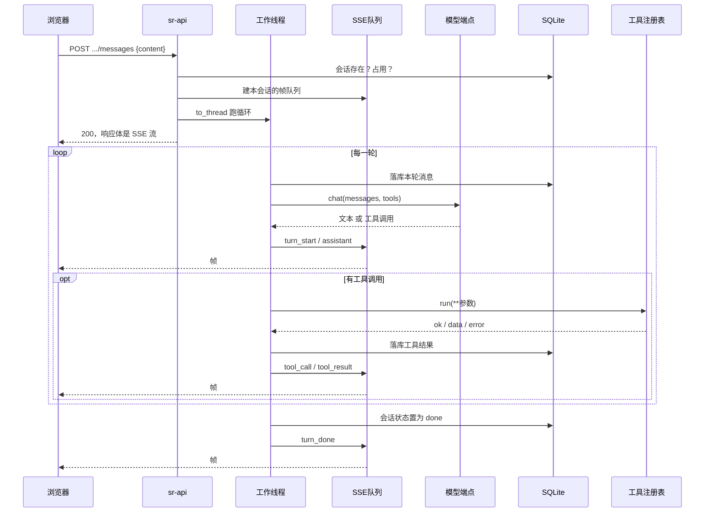
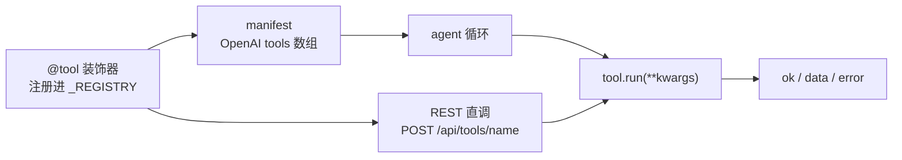

# 链路 D：对话到工具调用

> 日期：2026-09-23 · 状态：草稿（对照当日 `backend/agent/loop.py`、`backend/tools/`、`api/platform.py`）
>
> **目标读者**：要改 agent 循环、加工具、或对接 LLM 端点的人。
> **一句话摘要**：agent 是一段自写的循环——调模型、拿工具调用、执行、把结果回灌、
> 再调模型——每一步都落库，并同步以 SSE 帧推给浏览器。没有用编排框架。
>
> **协议**：模型侧走 OpenAI 兼容的 chat-completions 接口，因此不绑定具体供应商；
> 内网可指向任意兼容端点。端点未就绪时用假 LLM 跑通链路。

---

## 1. 为什么自己写循环

用编排框架会把「哪一步做了什么、什么时候落库」藏在框架里。这条链路要的恰恰是这些：
每一步都要能落库、能推帧、能在崩溃后接着跑。所以循环是自己写的状态机，
依赖只有模型客户端与工具注册表两样。

---

## 2. 一次对话



帧类型：`turn_start` / `tool_call` / `tool_result` / `assistant` / `error` / `turn_done`。
前端按帧归并出气泡与工具卡片，同一套归并函数也用于读历史，所以刷新前后不会换形状。

**并发保护**：每个会话一把锁，同一会话已有请求在跑时再发返回 409。
不同会话之间互不阻塞。

---

## 3. 线程桥

模型客户端是同步的，而 SSE 是异步的。桥的做法是：

```
在事件循环里建一个 asyncio.Queue
  → asyncio.to_thread(工作线程跑循环)
  → 循环里的 on_step 回调在**工作线程**里被调用
  → 用 call_soon_threadsafe 把帧投进队列
  → 事件循环那边 async for 取帧，yield 给 SSE
```

因此循环本身完全不知道 SSE 的存在——它只在一个 `on_step` 缝上同步回调。
这个缝是后来加的观测点，**不改变循环行为**：不加回调时循环照常跑。

---

## 4. 工具注册表



每个工具提供三样：名字、给模型看的「什么时候用它」的一句话、参数 JSON Schema；
执行后统一返回 `{ok, data, error}`。工具报错**不中断循环**——错误作为结果回灌给模型，
让它自己决定下一步，这也是循环不需要层层 try 的原因。

当前注册 4 个：`search_scenes`、`run_sr`、`sr_job_status`、`fix_bad_lines`。

> 「加一个工具 = 加一个带装饰器的函数」这句话的前提是**导入即注册**：
> `tools/__init__.py` 负责 import，漏了那行工具就不在表里。该文件的模块注释仍写着
> 「No tools registered yet」，是陈旧注释，以下方的 import 为准。

**同一个工具表服务两条入口**：agent 循环用 `manifest()` 生成模型的工具定义，
REST 的 `POST /api/tools/{name}` 直接调 `tool.run`。两边的 `run_sr` 参数归一
产出**同一个任务指纹**，由测试钉住一致性——所以从对话里提交的作业与从队列页提交的
同参数作业，在库里是同一行。

---

## 5. 持久化与断点

- 消息**逐条落库**，且落在产生副作用的步骤之前。崩溃重放时，库里能看出「这一步做过了」。
- 会话带 `resume` 时先读历史，再做一次断点修复：给「有工具调用但没有结果」的那一轮
  补一条合成结果，内容是「结果未知，不要盲目重试」。**绝不盲目重跑有副作用的工具**。
- 会话语义状态：`done` / `error`。轮次上限默认 8 轮，达到后以
  `max_turns=N reached` 结束并把会话置为 `error`。

---

## 6. 模型侧

| 环境变量 | 默认 | 说明 |
|---|---|---|
| `SR_LLM_BASE_URL` | 官方端点 | 可指向任意 OpenAI 兼容端点 |
| `SR_LLM_API_KEY` | 空 | |
| `SR_LLM_MODEL` | `gpt-4o-mini` | |
| `SR_LLM_MOCK` | 关 | `1` 时用固定脚本，不连任何端点 |

**假 LLM 是离机验收的基准**：`SR_LLM_MOCK=1` 时第一轮固定调 `search_scenes`，
拿到结果后给一段中文总结。它让「会话串行、SSE 帧序、工具结果回灌、历史恢复」
四件事在没有模型端点的情况下也能断言，见 [api-contract.md](../../planning/api-contract.md) §5.1。

内网目前没有可用的模型端点。**未配端点时不要打开真实调用**——循环会在第一轮就报错，
表现为对话直接结束。

---

## 7. 易判错点

- **`SR_LLM_MOCK` 是链路开关，不是「降级模式」**。它跑的是完整循环，只换掉了模型那一端。
- **同一会话并发会 409**，不是 500，也不是排队等待。
- **工具报错仍然算这一轮成功**。看到 `ok=false` 是工具的业务结论，不是循环崩了。
- **`max_turns` 用尽是 `error` 状态**，不是 `done`。别把它当成功。
- **REST 直调工具与 agent 调用共享同一份参数口径**，改一处要同时看另一处，
  一致性有测试兜着。
- **会话锁是按会话的**，不是全局。多个会话可以同时跑。
