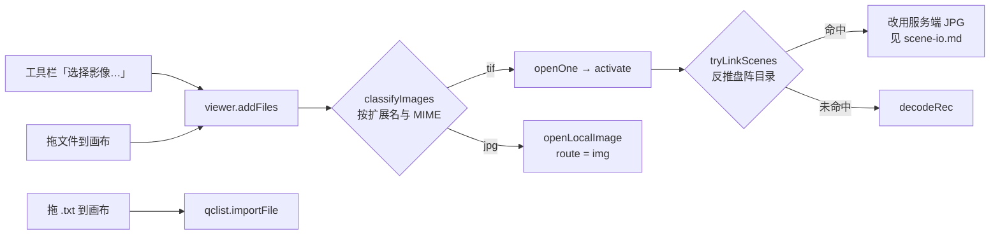
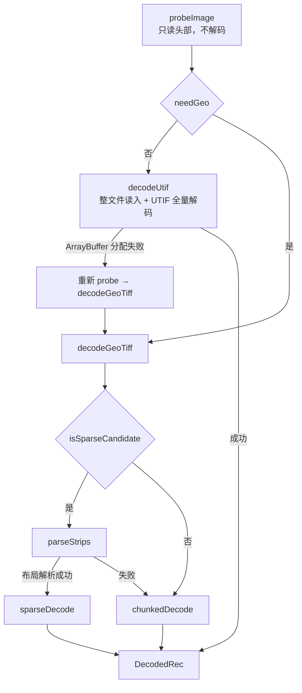
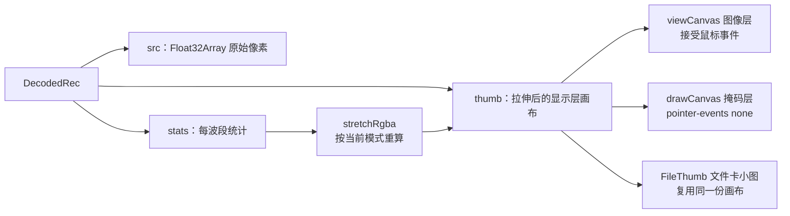

# 链路 A：本地影像到画布

> 日期：2026-09-23 · 状态：草稿（对照当日 `frontend/src/lib/` 代码）
>
> **目标读者**：要改查看器解码、拉伸或画布渲染的人；想弄清「为什么不整图解码」的人。
> **一句话摘要**：用户从本机选或拖进来的 TIF 完全在浏览器里解码——三条解码路按影像
> 特征分派，产出统一的内部结构，经拉伸后画到画布上。
>
> **范围**：只覆盖本地文件这条链路。盘阵场景的像素来自服务端烤好的 JPG，见 [scene-io.md](scene-io.md)。

---

## 1. 入口



关键设计：**本地 TIF 首次打开时先试一次盘阵关联**（`tryLinkScenes`），命中就直接用服务端
那份预览，不做本地解码。理由是本地全图解码在真机上要几十秒、几百 MB，而服务端那份
预览已经在手；顺带避开「本地图先画出来、几百毫秒后又被 JPG 顶掉」的闪烁。

未命中才走本地解码。**裸文件名 + 字节数**一起作指纹发给后端比对，只有双向都吻合才认命中。

---

## 2. 解码分派



`needGeo` 的判据是「**只有小的 8bit 无符号整数才走 UTIF**」：

```
small8 = sampleFormat == 1 && bits == 8 && spp <= 4 && 光度学可识别 && !BigTIFF
needGeo = !small8 || 解码字节数 > SAFE(1.3e9) || RGBA 字节数 > SAFE
```

**有意保留的一处偏差**：BigTIFF 即使满足 8bit 也强制走分块。仓库内置的 UTIF 解不了
BigTIFF（解码后宽高缺失），原实现会产出 0×0 缩略图。

| 路 | 读多少 | 输出长边 | 内存特征 |
|---|---|---|---|
| UTIF 全量 | 整个文件 | 2048 | 一次性分配整个文件的 ArrayBuffer，故设 `SAFE` 上限 |
| 稀疏条带 | 只读采样到的那几条条带的行 | 8192 | 峰值最低，是「秒级预览」的来源 |
| geotiff 分块 | 按 4096×4096 窗口逐块读 | 2048 | 累加器超预算时切带通模式 |

稀疏条带只在源满足「无压缩 + 每行一条带 + 单波段」时才是候选，且像素数要够大
（`SPARSE_MIN`，默认为 1e8，测试可用 `setSparseMin` 改写以便用小图跑同一条路）。
它的收益直接来自只读需要的行：接口上表现为「抽样 N 条条带，读 X MB / Y GB」。

分块的累加器是 `Float64Array`；当 `像素数 × 波段数 × 8` 超过 `BAND_ACC_LIMIT`（4e8）时，
改走**带通累加**，把内存从整图级别压到每带 `ACC_BAND_ROWS`（256）行的级别。

---

## 3. 数据源抽象

`lib/source.ts` 定义一个最小接口：`Source { size, read(offset, length) }`。

- `FileSource` 用 `Blob.slice` 实现，是本地文件链路的实现。
- `HttpSource` 只有契约占位，`read` 直接 reject，**全仓无调用点**——盘阵那条链路已改为
  读服务端烤好的 JPG，不再让浏览器按区间读 TIF。

保留这个抽象的价值在单测：解码算法只依赖 `Source`，可以在没有 `File` 对象的
Node 环境里跑（Vitest 的 environment 是 `node`）。

---

## 4. 显示层



三条要点：

- **`thumb` 是拉伸后的显示层画布，不是原图**。切换拉伸模式时重算 `stretchRgba` 并
  `putImageData` 回同一份画布，再自增重绘信号。
- **重绘由单一信号驱动**：store 里任何影响视图的状态变化后自增 `renderTick`，
  `TifCanvas` 监听它并重绘。组件不各自持有渲染时机。
- **两个画布同几何**：图像层接事件，掩码层只负责叠加显示，不与事件竞争。
  文件卡的小图直接复用 `thumb`，不另拉网络图。

`DecodedRec` 里的 `route` 记录这次走的是哪条路（`utif` / `sparse` / `chunked` /
`jpg` / `img`），状态栏会显示它，排障时先看这一项。

### 拉伸

16bit 影像值域 0~65535，屏幕只有 0~255，显示前必须映射。可选模式里两种是确定的：

- **2% 线性**：取 2% / 98% 分位作两端。
- **直方图均衡**：取整幅 min/max，建 1024 桶累积直方图，按 CDF 重映射。

服务端烘焙用的是直方图均衡，且是与前端**逐式镜像**的一份实现——两处公式故意不完全相同
（一个用桶数、一个用桶数减一），改任一端都要看 [preview-bake-pipeline.md](../preview-bake-pipeline.md) §4.5。

---

## 5. 掩码

掩码在浏览器里生成两份产物（`掩码.tif` 与 `掩膜中心点坐标.txt`，直接下载），也可以把
矢量的多边形 JSON 交给后端栅格化落到盘阵——后者是链路 C 的起点，见 [sr-io.md](sr-io.md)。

坐标全部换算到**源影像的元数据尺寸**：

- 本地链路的元数据尺寸就是解码出的 `W` / `H`。
- 盘阵链路是场景行里的 `W` / `H`，**不是 JPEG 的像素尺寸**。所以换档位重烤不影响掩码落点。

`maskgen.ts` 里是可单测的纯算法：多边形栅格化、连通区域合并、魔棒（洪泛 + 填洞 +
轮廓简化）、TIFF 编码。它与后端 `services/mask.py` 的填充语义对齐，交叉比对脚本在
`.e2e/pillow_ref.py`。

---

## 6. 上限与常量

| 常量 | 值 | 作用 |
|---|---|---|
| `SAFE` | 1.3e9 | 单次 `ArrayBuffer` 分配的安全线，超过就走分块 |
| `CANVAS_AREA_MAX` | 16384² | Chromium 画布面积上限 |
| `PREVIEW_MAX` | 2048 | 分块 / UTIF 路径的预览长边 |
| `SPARSE_PREVIEW_MAX` | 8192 | 稀疏条带路径的预览长边 |
| `SPARSE_MIN` | 1e8 | 走到稀疏条带所需的最小像素数 |
| `BAND_ACC_LIMIT` | 4e8 | 分块累加器超此字节改带通累加 |
| `ACC_BAND_ROWS` | 256 | 带通累加每带输出行数 |
| 分块窗口 | 4096×4096 | geotiff 分块读取的窗口尺寸 |

**内存账**：一条记录的像素常驻内存约 `8 字节/像素`（`thumb` 画布 4 + `src` Float32 4），
尺寸取预览尺寸、不封顶。所以档位越低（÷ 得越多）常驻越小。当前没有 LRU 释放，
这是 [current-question.md](../../status/current-question.md) §3.3 已记录未处理的一项。

---

## 7. 易判错点

- **`SAFE` 是 1.3e9 而不是 2GB**：留了余量给同一时刻的其它分配，不是精确上限。
- **BigTIFF 强制走分块**是有意的偏差，不是遗漏。
- **`HttpSource` 是死代码**，看到它不要以为浏览器会按区间读盘阵 TIF。
- **`tifDecode.ts` 里仍留着 `JPG_MAX` / `JPG_QUALITY` / `planExport`**，属浏览器侧 JPG
  导出链路的遗留；该链路 2026-09-15 已整体删除，这些常量不再被生产路径使用。
- **本地链路的 2048 / 8192 与服务端烘焙的档位无关**，两套常量不共用。
