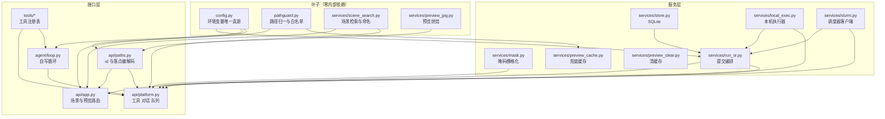

# 模块交互总表与跨层纪律

> 日期：2026-09-23 · 状态：草稿（对照当日代码，import 关系逐条核过）
>
> **目标读者**：要动跨模块改动的人；需要一张「谁调谁」的地图来做影响面评估的人。
> **一句话摘要**：后端是一条单向依赖链——叶子模块不认识业务，业务服务不认识路由；
> 17 个端点各自只经过两三层就落到磁盘或子进程。

---

## 1. 后端依赖方向

四条硬约束（打破它们会立刻出现循环依赖）：

1. **`config.py` 不 import 任何 services**。它是所有默认值的单一真源，碰谁都会成环。
2. **`pathguard.py` 零内部依赖**。它被路由层与缓存层共用，一旦开始 import 业务就成环。
3. **`preview_cache.py` 只依赖 pathguard**，不 import `api/paths.py`。
4. **服务层不认识 HTTP**。`services/*` 里没有 FastAPI 的类型，路由层负责把异常翻译成状态码。

`config.py` 的 `sr_runtime()` **每次调用都重读环境变量、从不缓存**——这样测试能按用例
改配置，真机上也不必为了改一个值而重启。反过来，`load_config()` 在应用创建时读一次。

---

## 2. 端点 → 处理 → IO 全表

17 个端点。列「落到哪」是为了估算影响面：改一个服务会不会动到别的端点。

| 端点 | 处理函数 | 经过的服务 | 落点 |
|---|---|---|---|
| `GET /api/health` | app | — | 无 |
| `GET /api/scenes` | app | scene_search、preview_jpg | **递归列举** `SR_SCENES_ROOT`；逐行读头 |
| `POST /api/scenes/resolve` | app | pathguard、scene_search | 只 `stat` 点名的路径；**不列举** |
| `GET /api/scenes/{id}/preview` | app | preview_jpg | 读/写盘阵预览 JPG |
| `GET /api/scenes/{id}/preview-drop` | app | preview_jpg、preview_cache | 写盘阵；失败退临时桶 |
| `POST /api/scenes/clear-preview` | app | preview_clear | **删盘阵文件** |
| `GET /api/scenes/{id}/siblings` | app | scene_search、preview_jpg | 纯只读，固定候选名 `is_file` |
| `GET /api/tools` | platform | tools 注册表 | 无 |
| `POST /api/tools/{name}` | platform | 对应工具 | 视工具而定 |
| `POST /api/chat/sessions` | platform | store | SQLite |
| `GET /api/chat/sessions` | platform | store | SQLite |
| `GET /api/chat/sessions/{id}/messages` | platform | store | SQLite |
| `POST /api/chat/sessions/{id}/messages` | platform | agent/loop、tools | **调模型**；工具副作用 |
| `GET /api/queue` | platform | store、run_sr、local_exec/slurm | **读退出码文件**；可能写库与广播 |
| `POST /api/queue` | platform | run_sr、local_exec/slurm | 写 work 目录两份文件；**起进程** |
| `POST /api/queue/{id}/cancel` | platform | local_exec/slurm | 发信号 / 取消作业 |
| `GET /api/queue/events` | platform | — | SSE 长连 |
| `POST /api/masks` | platform | mask | **写盘阵掩码 tif 与 txt** |
| `POST /api/qclist/write` | platform | pathguard | **原子写盘阵 txt** |

表里的「**不列举**」是硬约束：`resolve` / `preview` / `siblings` 这几条请求路径
被测试钉住禁止列举目录，只许 `stat` 用户明确给出的那一个路径。

---

## 3. 前端结构

```mermaid
flowchart LR
  subgraph PAGES["页面"]
    P1["/viewer 查看器"]
    P2["/scenes 场景库"]
    P3["/queue 共享队列"]
    P4["/chat 对话"]
  end
  subgraph STORES["Pinia store"]
    S1["viewer"]
    S2["scenes"]
    S3["queue"]
    S4["chat"]
    S5["qclist"]
    S6["notices"]
  end
  subgraph LIB["lib 纯函数层"]
    L1["api.ts<br/>唯一 REST 与 SSE 客户端"]
    L2["scene.ts<br/>URL 拼装 档位 场景行类型"]
    L3["decode / tifDecode<br/>解码与拉伸"]
    L4["maskgen<br/>掩码算法"]
    L5["blobCache<br/>预览字节 LRU"]
    L6["viewMath / roiStats / compare"]
  end
  PAGES --> STORES
  STORES --> LIB
  LIB --> BACKEND["后端 / nginx"]
```

分层意图：**组件只管显示与事件，store 管状态与编排，lib 是无副作用的纯函数**。
唯一持有画布的组件是 `TifCanvas.vue`，重绘由 store 里的一个自增信号驱动。

一处例外值得知道：场景列表接口**没有走 `api.ts`**，由 `stores/scenes.ts` 直接 `fetch`
——因为它的 query 串拼装在 `lib/scene.ts`，两处拼反而更容易漂。

---

## 4. 前端与后端的交互点

| 触发 | 端点 | 前端随后做什么 |
|---|---|---|
| 进场景库 / 检索 | `GET /api/scenes` | 填表格；失败写本页错误 |
| 行「打开」 | `GET /api/scenes/{id}/preview` → 静态 URL | 档位不符时才重烤；取字节后画到画布 |
| 粘路径 / 拖文件 | `POST /api/scenes/resolve` | 命中则就地升级记录；失败把后端原因原样展示 |
| 拖入链取图 | `GET /api/scenes/{id}/preview-drop` | 读回退响应头，如实说明落在临时缓存 |
| 保存掩码 | `POST /api/masks` | 记下服务端掩码路径 |
| 提交 SR | 无网络调用 | 写入队列草稿并跳转队列页 |
| 队列页 / 侧舱 | `GET /api/queue`、`GET /api/queue/events` | 合并状态帧；失败原因单独记 |
| 提交作业 | `POST /api/queue` | 清草稿并刷新列表 |
| 发送消息 | `POST .../messages`（SSE 体） | 乐观上屏，逐帧归并 |
| 清单「同步」 | `POST /api/qclist/write` | 成功提示回显路径与编码 |

**路径权威在后端**：前端不自拼候选路径，只发裸文件名或整条路径。

**错误展示面分治**：场景库的错误只在场景库页渲染，查看器的错误只在查看器页渲染。
跨页调用必须把错误串传出去，而不是就地弹窗——所以有些 action 返回的是错误字符串
而不是布尔值。这是有意设计，不是接口不一致。

---

## 5. 跨层纪律速查

| 纪律 | 为什么 |
|---|---|
| 掩码坐标一律用**源影像元数据尺寸** | 预览是降采样的，用 JPEG 尺寸会让掩码整体错位 |
| 预览缓存的档位**读盘上那份的注释**，不信前端记忆 | 换机器、别人先烤过，前端记忆就是错的 |
| 解码结果落笔前**比对代号** | 本地解码可能耗时几十秒，期间记录已被升级成服务端 JPG，过期结果不能覆盖新图 |
| **环境变量是唯一的配置入口** | 内网离线，配置文件分发成本高于改 systemd |
| **两个包同版本更新** | 前后端之间没有版本协商 |
| **不 import SR 侧任何模块** | 两侧解释器与依赖完全不同，只通过批脚本文本交接 |
| **终态只认退出码文件** | 退出码 0 有多种含义，账务命令在真机永久不可用 |
| **服务层不返回 HTTP 概念** | 异常到状态码的翻译集中在路由层，便于单测服务 |

---

## 6. 离机怎么验

`.e2e/` 是这套拓扑的可执行替身：用无头浏览器 + 本地静态服务顶替 nginx 的两个 location，
用真 uvicorn 跑后端，用假 LLM 与假调度器顶替两个外部依赖。
跑法见 [current-question.md](../../status/current-question.md) §6.3。

| 替身 | 顶替谁 | 开关 |
|---|---|---|
| 本地静态服务 | nginx 的 `/disk-array/` 与 SPA fallback | 脚本内置 |
| 假 LLM | 模型端点 | `SR_LLM_MOCK=1` |
| 假调度器 | Slurm | `SR_SLURM_FAKE=1` |
| 临时盘阵根 | 真实盘阵 | `SR_SCENES_ROOT` 指到临时目录 |

因此**改 nginx 站点配置或 systemd 单元时，`.e2e/` 里对应的替身也要同步**——
它是配置的可执行规格说明。
