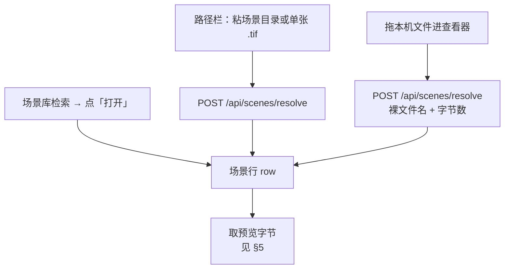
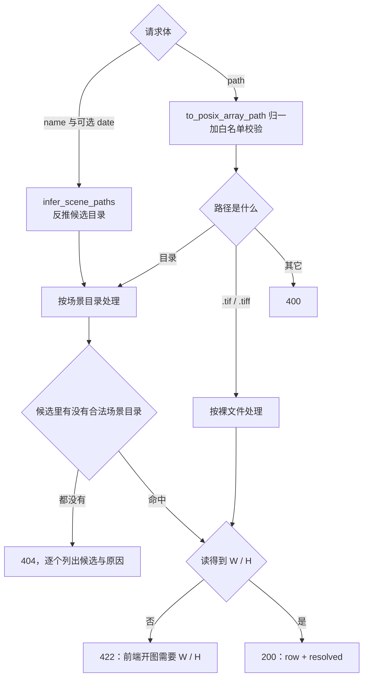
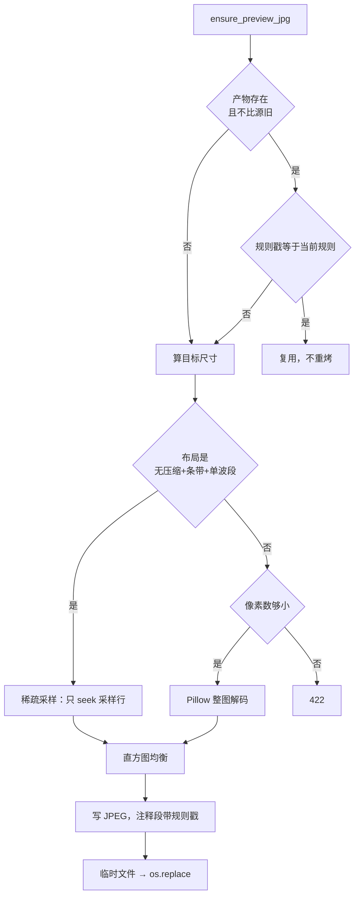
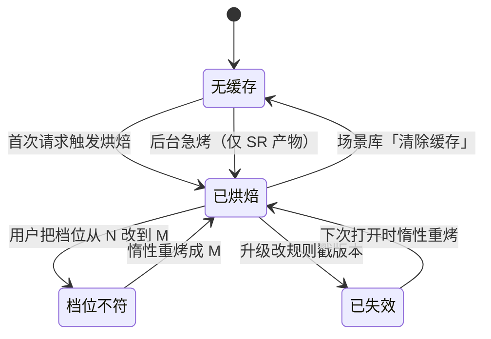
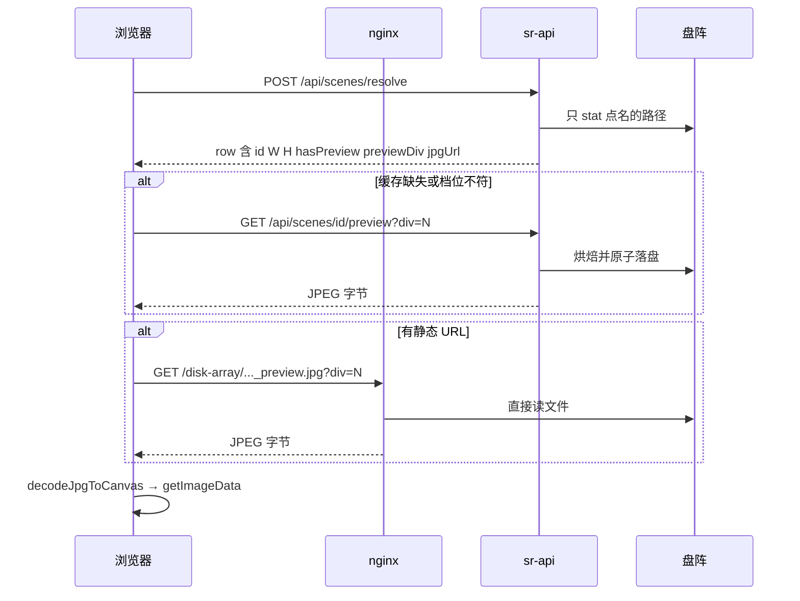

# 链路 B：盘阵场景到画布

> 日期：2026-09-23 · 状态：草稿（对照当日 `backend/api/app.py`、`services/preview_jpg.py`、`api/paths.py`）
>
> **目标读者**：要改场景检索、路径反推、预览烘焙或缓存规则的人。
> **一句话摘要**：盘阵上的原始 TIF 不进浏览器；服务端就地烤一张降采样的灰度 JPEG，
> 浏览器读那张 JPEG。缓存在不在、还合不合当前规则，由写在 JPEG 注释里的规则戳决定。
>
> **细节不在本文件重复**：烘焙的采样公式、拉伸对齐、缓存失效的逐条理由见
> [preview-bake-pipeline.md](../preview-bake-pipeline.md)。本文只讲**链路上谁调谁**。

---

## 1. 为什么这条链路是这个形状

浏览器有两项硬上限：单次 `ArrayBuffer` 分配约 2GB，Canvas 面积上限 16384²。
盘阵上的真实场景是 GB 级、两万四千像素级，像素数据本身与转 RGBA 后的体积都超出上限，
所以浏览器侧不存在「整幅解码」这个选项。

历史方案「浏览器 + nginx Range 按需读 TIF 字节」已废弃。现在盘阵路径完全不碰原始 TIF 字节。

---

## 2. 三个入口，一个端点族

三条入口的差别只在 **row 从哪来**，之后的取字节与显示完全共用。

### 2.1 检索是唯一会列举目录的端点

`GET /api/scenes` 对 `SR_SCENES_ROOT` 递归列举，用白名单筛出场景：
文件所在目录须含 `<目录名>_meta.xml`，且文件名是 `<目录名>.<ext>` 或 `PAN.<ext>`。

**准确口径**：仓库里「后端禁止扫盘」这条约束指的是**请求路径上不得列举目录**，
`resolve` / `preview` / `siblings` 由测试钉住（把 `rglob` / `glob` / `iterdir` /
`listdir` / `scandir` / `walk` 打成 `AssertionError`）。检索端点本身当然要列举——
它就是干这个的。`current-question.md` §5 把这条写成了全局约束，读时按本段口径理解。

白名单的代价是明确的：没有那份 `_meta.xml` 的目录整个不显示。

### 2.2 resolve 不提候选路径

两条纪律：

- **命名规则的唯一真源在后端** `pathguard.py`。前端不实现那套正则，只发裸文件名或整条路径。
- **反推失败不静默换路径**。全部候选都不中才 404，并把每个候选落空的原因写进 `detail`
  ——是缺 `_meta.xml`、还是目录里没有输入影像、还是粘错了层，分别说清。

`resolved` 里带 `sr_capable`：目录分支恒为真；裸 `.tif` 分支只有在父目录恰好是合法
场景目录、且该目录的输入影像就是这个文件时才为真。前端据它决定「提交 SR」是否可用。

### 2.3 拖入的指纹是两个

拖进来的不是目录而是文件，所以要先认它属于哪个场景。判据是**文件名 + 字节数**两项：
只比字节数的话，用户拖进来的可能是一张不是 SR 实际会读的影像，之后画的掩码坐标
会整片落在别的图上。拖 `.jpg` 时比的对象不同（显示件与输入 TIF 是两份产物，字节数必然不等），
规则见 [api-contract.md](../../planning/api-contract.md) §3.5。

---

## 3. 烘焙与缓存

**命中要两条同时成立**：产物不比源旧，且注释里的规则戳等于当前规则。
只判修改时间会在换规则后失效——升级前烤的图修改时间就是比源新，只看时间会把它
永久判为有效，用户看不到任何变化。

规则戳形如 `srprev:v3:div4+equal:q85`，覆盖尺寸档位、拉伸规则、JPEG 质量三者。
改其中任何一项都要 bump 对应部分，否则旧缓存不会失效。

### 落点

预览的**文件名全平台只有一条**：`<源 stem>_preview.jpg`。目录有三种情形：

| 场景 | 目录 | 说明 |
|---|---|---|
| 库内 | 源同目录；配了 `SR_PREVIEWS_ROOT` 则搬进镜像树 | 镜像树必须在 `SR_SCENES_ROOT` 之下，否则 nginx 单根 alias 覆盖不到 |
| 库外（粘路径、裸 tif） | 源同目录 | 不走静态 URL，不需要在 URL 层面可映射 |
| 拖入 | 源同目录，**不吃** `SR_PREVIEWS_ROOT` | 要的是「烤一次长期可用」 |

三条链统一文件名之前，同一份栅格会烤出两份落点。改名后，每条链在处理到那份栅格时
顺手删掉旧的 `<stem>.preview.jpg`。

源文件本身就是 `.jpg` 时（盘阵里的显示件）不烘焙：缓存标志恒真，档位恒为空，
静态 URL 直接指向源文件。

---

## 4. 缓存状态与档位

两个容易判错的点：

- **`hasPreview` 为真不等于当前档位就对**。它只说明盘上有一份缓存。判据是
  「缓存存在 **且** 其档位等于当前档位」；档位读不出来（旧格式戳）同样按不符处理，
  代价只是一次惰性重烤。
- **档位必须读盘上那份 JPEG 的注释**，不能靠前端记住自己选了哪档。前端记住的只是
  本次会话的选择，换台机器或别人先烤过，记忆就是错的。

带下划线的落点还有一条副作用：它不在场景检索的白名单里，所以不会把预览件自己
收成一行场景。

---

## 5. 取字节的三条路

| 情形 | 走哪条 | 为什么 |
|---|---|---|
| 库外（粘路径 / 裸 tif） | `/api/scenes/{id}/preview` 回字节 | 没有可映射成静态 URL 的位置 |
| 库内、缓存已就绪 | nginx 静态 URL | 由 nginx 原生缓存承担重复请求，不过后端进程 |
| 库内、缓存未就绪 | 先打一次 `/preview` 把它烤出来，再取静态 URL | nginx 不会去触发后端生成 |
| 拖入链 | `/api/scenes/{id}/preview-drop` 回字节 | 响应带 `Cache-Control: no-store` |

档位变化靠前端在静态 URL 上拼 `?div=N` 击穿 nginx 的 1 小时 `max-age`：
查询串变了，浏览器拿不到旧档位那张。

前端另有一层**按字节封顶的 LRU 缓存**（`lib/blobCache.ts`），键是
`场景 id | 档位 | jpg`。缓存的是压缩态 blob 而不是解码后的位图——位图一条就是几百 MB，
而已经在清单里的图，像素本来就常驻在记录里。清除服务端缓存时必须同步丢掉本地这一份，
否则同一会话里再打开会直接命中旧字节，用户以为清除没生效。

**掩码与 ROI 的坐标换算走场景行的 `W` / `H`**（源影像尺寸），不是 JPEG 的像素尺寸。
所以换档位重烤不影响掩码落点。

---

## 6. 另外两个只读与删除端点

| 端点 | 做什么 | 关键约束 |
|---|---|---|
| `GET /api/scenes/{id}/siblings` | 回报这个场景的三类图：输入影像 / 本轮产物 / NOSR | 纯只读：固定候选名的 `is_file()`，永不烘焙、永不写盘、永不列举目录 |
| `POST /api/scenes/clear-preview` | 清除预览缓存 | 唯一会删盘阵文件的端点 |

`siblings` 的 `suffix` 取值顺序是「用户断言 → 最近一条已完成任务的参数 → 配置缺省」，
并把**实际用了哪一个**如实回报——「按配置猜的名字」与「真跑过的名字」看起来一样，
不标出来就分不清。

`clear-preview` 返回 200 只代表请求被受理，逐条结论在 `results` 里：
`nothing`（本来就没有）/ `skipped`（不能清，带原因）/ `failed`（删不掉，带原因）
都是合法结局。**同一个场景的两行只清一次是设计**：`<目录名>.tif` 与 `PAN.tif`
指向同一个目录，按父目录归并后逐目录处理。

删除功能依赖 `nginx` 对盘阵目录的 `unlink` 权限，这一条真机尚未验证；
无权时该功能只逐条报失败，不删任何文件。

---

## 7. 后台的三个循环

它们不在任何请求路径上，由 lifespan 起：

| 循环 | 周期 | 做什么 |
|---|---|---|
| 队列状态校准 | `SR_QUEUE_POLL_SEC`，默认 2 秒 | 读每个未终结作业的终态并广播 |
| 临时预览桶清扫 | 启动先清一次，之后每本地 0 点 | 删过期的兜底缓存桶 |
| 产物预览急烤 | 同队列周期 | 每轮烤**一件**已完成的 SR 产物预览 |

急烤那条受 `SR_PRODUCT_PREVIEW_DIV` 控制（`0` = 关），并受
`SR_PRODUCT_PREVIEW_MAX_AGE_SEC` 的年龄窗口约束——那是升级当天不把历史已完成行
全部重烤一遍的唯一屏障。每轮只烤一件是有意的：烤一份大产物峰值内存几百 MB、
要把整个文件读一遍，并发会把内存与盘阵带宽一起乘上去。

---

## 8. 易判错点

- **`jpgUrl` 有值不等于缓存已存在**。库内的行给的是「缓存该在的位置」，
  判「这次会不会触发烘焙」要看缓存标志与档位，不是 URL 是否为空。
- **`W` / `H` 是源影像尺寸，不是 JPEG 尺寸**。两者差一个档位倍数，不是 bug。
- **改烘焙规则不需要清理盘上的旧缓存**。旧图没有新戳，首次打开时会被判失效并原地重烤，
  是惰性的，不是一次性全量。
- **库外与拖入两条链的落点同名**，差别只在目录，别按文件名区分它们。
- **检索的白名单是「有 `_meta.xml`」**。看不到某个目录时先查这份 xml，不要先怀疑路径。
