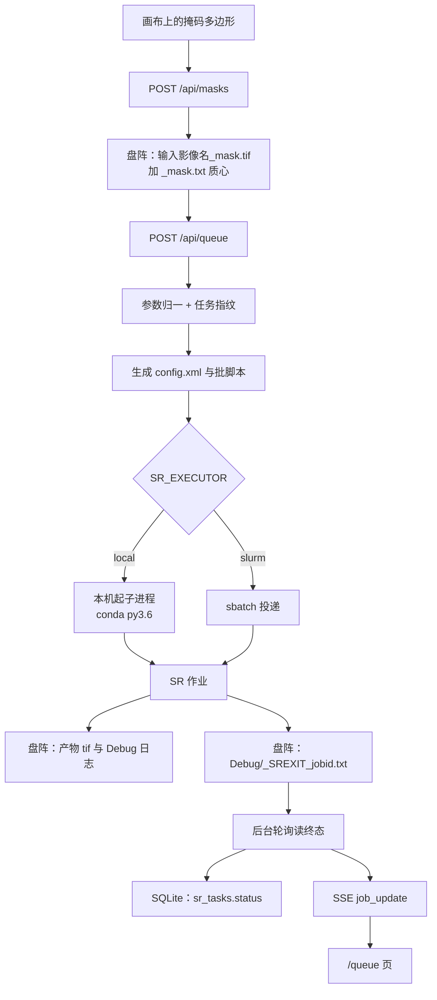
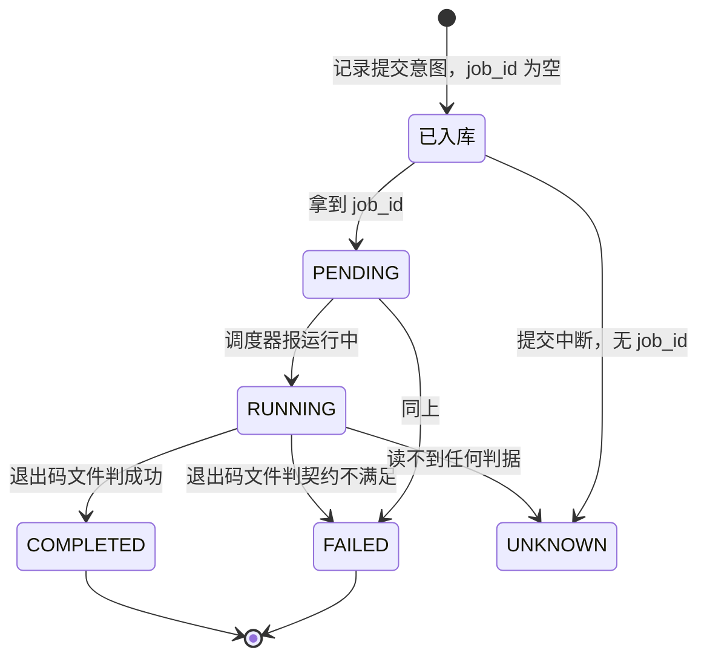
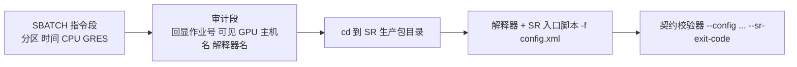
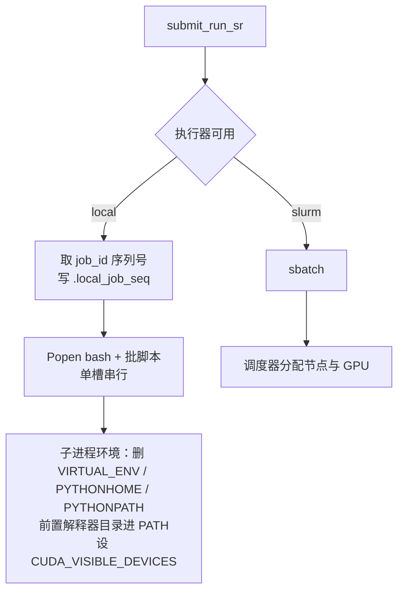
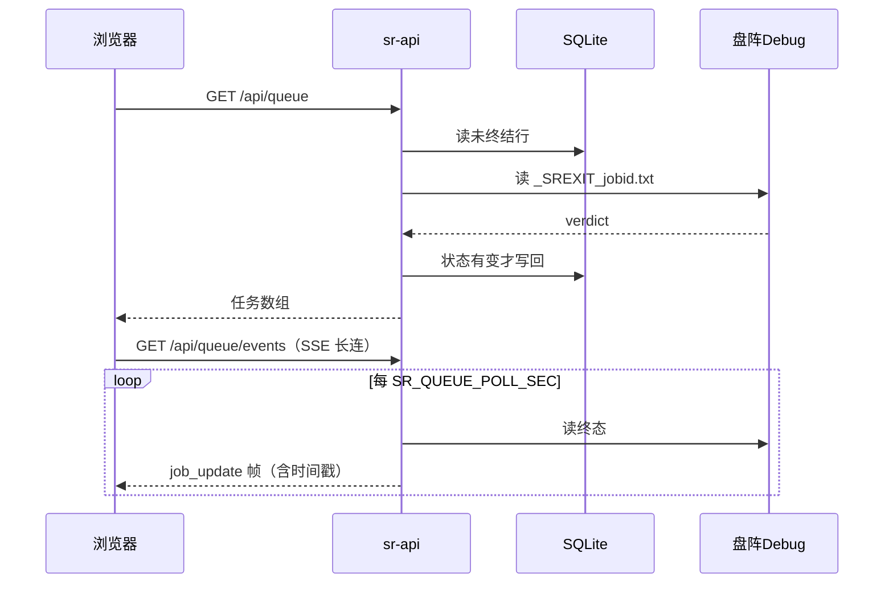

# 链路 C：掩码到 SR 作业与队列

> 日期：2026-09-23 · 状态：草稿（对照当日 `backend/api/platform.py`、`services/run_sr.py`、`services/local_exec.py`、`SR_code/`）
>
> **目标读者**：要改提交链路、终态判定、队列状态的人；需要向别人解释「这作业到底成没成」的人。
> **一句话摘要**：掩码先落到盘阵，提交时后端生成 config.xml 与一份批脚本，
> 用 SR 生产解释器起进程；作业自己写一个退出码文件，后端读它定终态——**不看调度器账务**。
>
> **算法侧不自研**：超分算法调用 SR 生产脚本，平台只负责参数、路径、执行与状态。
> 算法与调用契约见 [docs/sr_code/](../../sr_code/)。

---

## 1. 全景



---

## 2. 掩码落盘

掩码在浏览器里画好之后，矢量多边形交给后端栅格化：

```
POST /api/masks  { lq_path 或 scene_id, W, H, polygons }
  → services/mask.py
  → <输入影像名>_mask.tif   值域 0/255
  → <输入影像名>_mask.txt   各连通域质心坐标
```

- **0 = 不处理，255 = 处理**（`255` 那一侧才是要超分的区域）。SR 侧按「大于 0」读取。
- 坐标是**源影像的像素坐标**：x 为列、y 为行。盘阵场景的源影像尺寸取场景行的 `W` / `H`，
  与预览 JPG 的像素尺寸无关，所以换档位不影响掩码。
- 目标目录由后端从 `lq_path` 或场景 id 推出来，并过路径白名单；写盘失败回 422。
- **也可以不经过后端**：浏览器直接生成 `掩码.tif` 与 `掩膜中心点坐标.txt` 下载。
  那条路不写盘阵，适合离线留档。

---

## 3. 提交：归一与幂等

```
POST /api/queue  { lq_path, mask_path?, sr_scale?, suffix?, gpu?, cloud_limit?, ... }
  → _norm_sr_params
  → services/run_sr.submit_run_sr
```

三件事在归一阶段完成：

1. **路径归一与白名单**：盘符形态合成 POSIX 形态，再校验前缀。
2. **掩码推导**：请求不带 `mask_path` 时，按 `<lq_path>/<输入影像 stem>_mask.tif` 推导；
   文件不存在直接 400——**不静默退化成整图超分**。
3. **锁定目录**：配了 `SR_LOCKED_DIR` 时，队列只接受这一个场景目录，其余 400。
   这是最小原型阶段把影响面收在一个目录里的开关。

**幂等靠任务指纹**：提交参数规范化后取 sha256，是 `sr_tasks` 表的唯一键。
同参数重交复用同一行，不会投出第二个作业。指纹进聚合了默认后缀，所以那个默认值
**刻意不做进程内缓存**——缓存会让指纹依赖进程启动时刻，反而造成重复投递。



提交顺序是**先记意图再记 job_id**：中途崩溃重放时，靠调度器活跃状态或退出码文件
去解析，而不是盲目再投一次。中断遗留（有行、无 job_id）的行重交时返回 409。

---

## 4. 生成两份文件

| 文件 | 位置 | 内容 |
|---|---|---|
| `run_sr_<后缀>_<指纹前 12 位>.xml` | `SR_SLURM_WORK_DIR` | config.xml：`DatarootLQ` / `SRScale` / `Suffix` / `MaskPath` / `CloudLimit` / `GridAlign` |
| 同名 `.sh` | 同上 | 批脚本：`#SBATCH` 指令 + 审计段 + 跑 SR 脚本 + 跑校验器 |

批脚本的三段：



四条设计约束：

- **`--export=NONE`**：批脚本不继承提交进程的环境。因此 `SR_SR_SCRIPT` 与
  `SR_VERIFY_SCRIPT` 在**生成时**就解析并写死进脚本文本——改这两个值必须重启服务。
- **不写 `CUDA_VISIBLE_DEVICES`**：选卡交给调度器的 `--gres`。本机直跑路线没有调度器，
  由 `SR_LOCAL_GPU` 透传。
- **省略 `set -e`**：要让校验器有机会在 SR 脚本失败后仍然跑起来并写下判词。
- **沙箱段每次重新复制**，不做「已存在就跳过」。作业对工作目录不是只读的，
  复用副本会让上一次的产物混进来。**本机直跑路线必须不配沙箱**，
  它会把产物指到副本，违背「输出与原图同目录」。

---

## 5. 执行器



| | `local` | `slurm` |
|---|---|---|
| 并发 | 单槽串行（模块级锁） | 由调度器决定 |
| job_id | 自增，持久化在 `.local_job_seq` | 调度器给 |
| 选卡 | `SR_LOCAL_GPU` 透传 | `--gres` |
| 取消 | 对进程组发信号（Windows 用 `taskkill /T`） | `scancel` |
| 终态判据 | **同一条：退出码文件** | 同左 |

两种执行器返回同一种状态字典，所以上层代码不需要分支。**终态判据完全一致**——
这正是「`sbatch` 换成 `bash`」这个最小原型能成立的原因：批脚本本身是合法 bash，
`#SBATCH` 那些行在 bash 眼里就是注释。

---

## 6. 作业内的 IO（SR 侧契约）

```
<SR 解释器> <SR 入口脚本> -f <config.xml>
```

| 项 | 内容 |
|---|---|
| 输入 | config.xml；`DatarootLQ` 目录里的输入影像与 `<目录名>_meta.xml` |
| 输出 | `<输入名>_<Suffix>.tif`；`Debug/<输入名>_SRLOG.txt`，末行 `Run finished.` |
| 退出码 | 0 = 情况繁多（含云量跳过、配置缺失等提前返回）；1 = 运行期异常；3 = GPU 相关；90 = 契约不满足 |

**退出码 0 不等于成功**。这一点是整条链路最要紧的口径：生产脚本有若干条「正常提前返回」
的分支（云量超限、输入缺失）也是 `exit(0)`，只看退出码会把它们全判成成功。
所以引入了第二个进程——**契约校验器**，紧跟 SR 脚本之后跑，逐条验：

1. SR 进程退出码为 0；
2. 日志末行是 `Run finished.`（尾读字节取最后非空行，不是按行读）；
3. 输出 tif 存在且非空。

三条都满足写 `verdict=0`，否则写 `verdict=90`。合法的跳过（末行以 `Run skipped:` 开头）
只要求前两条。

判词写成文件：

```
<DatarootLQ>/Debug/_SREXIT_<job_id>.txt
job_id=…  sr_exit_code=…  verdict=0|90  skip=0|1  reason=…
```

**这是一个跨语言契约**：写入方是 SR 作业侧的 Python 脚本，读取方是平台后端；
两边各自拼这个路径，命名约定由测试钉住，改一边必须改另一边。

---

## 7. 终态与回流

后端**不读调度器账务**（真机 `AccountingStorageType=none`，账务命令永久不可用）。
终态一律来自退出码文件：



几个必须知道的判据：

- **无 job_id 的行绝不发明终态**，如实回库里的状态。那是「提交中断」，不是「跑挂了」。
- **比较基准是内存缓存，缓存缺失回落库里的状态**。不回落的后果是服务一重启，
  每一行都被判成「状态变了」，于是所有历史行被写回一次、耗时列集体退化成行龄。
- **SSE 帧必须带上写库后的时间戳**。只推状态的话，客户端手上的还是上一次 GET 的快照，
  耗时列要么显示 0 秒，要么停在上一次的数字上。
- **耗时口径是纯算力时长**（开始跑 → 跑完），不含排队。

队列状态只有五个：`PENDING` / `RUNNING` / `COMPLETED` / `FAILED` / `UNKNOWN`。

---

## 8. 易判错点

- **退出码 0、`Run finished.`、产物存在，三者缺一不可**。任何单独一项都不足以判成功。
- **终态不看 `sacct`**。那台机器上账务没启用，任何依赖它的判据都会永久失效。
- **`verdict=90` 是「契约不满足」，不是「SR 算法失败」**。两者要分开报，否则排障方向会错。
- **掩码必须落在本体影像的网格上**。产物是它的放大结果，拿产物的尺寸写掩码会
  把一张产物尺寸的掩码盖到本体的掩码文件上。前端用「环节」这个概念把这件事一路带住。
- **`SR_SANDBOX_ROOT` 与本机直跑互斥**。配了沙箱，产物会落在副本而不是原目录。
- **平台默认执行器是 `slurm`，当前路线是 `local`**。换机器重建配置时漏了这项会退回投递 Slurm。
- **已超分过的场景会被再超分一遍**。生产脚本里那段「已超分则跳过」的分支历史上被改成了
  打印一行就返回，不是幂等跳过；现场景落在这种状态时作业会提前结束、不产出新产物，
  校验器据此判失败。这是当前 A 段收尾的阻塞项。
