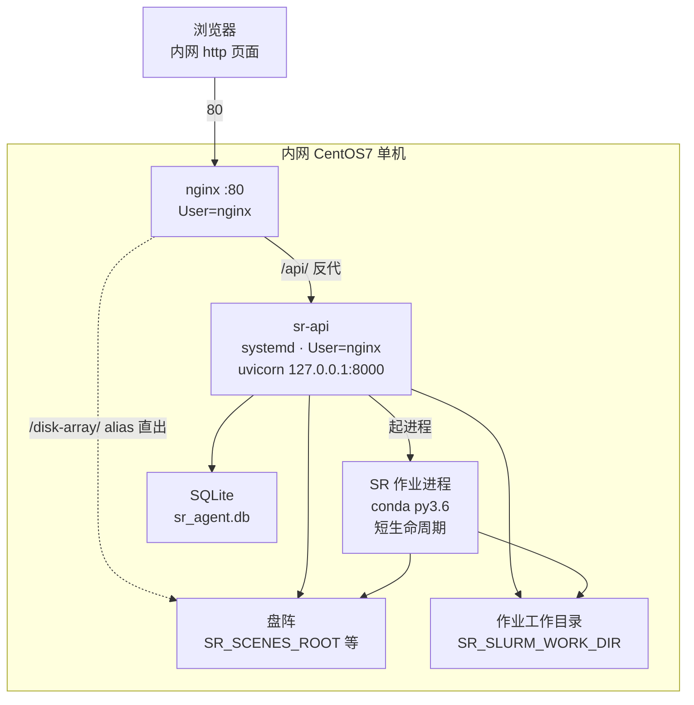
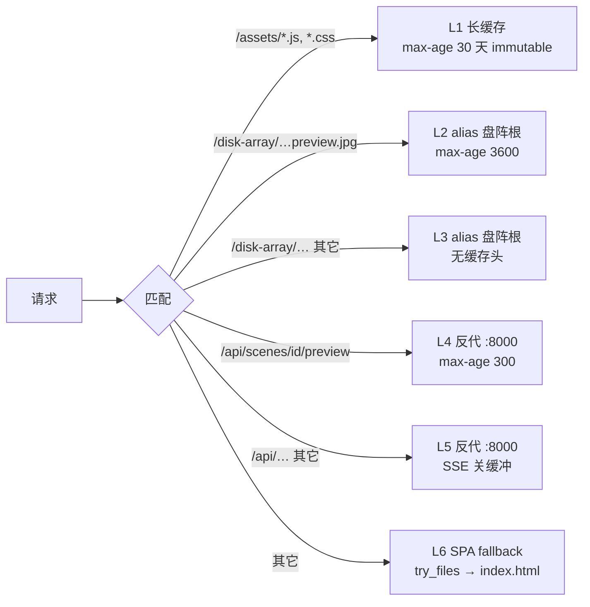
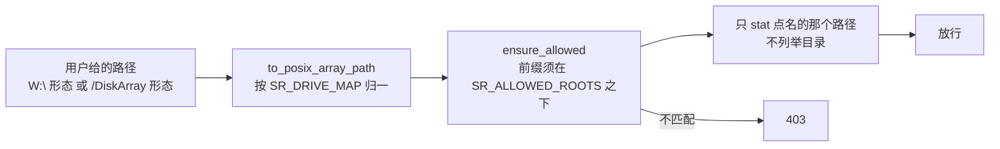

# 部署拓扑与进程边界

> 日期：2026-09-23 · 状态：草稿（对照当日代码与 `deploy/` 模板；真机实测值见 [current-question.md](../../status/current-question.md) §6.1）
>
> **目标读者**：负责部署、排障、升级的人。
> **一句话摘要**：一台 CentOS7 内网机上跑着五个角色——nginx、sr-api、SR 作业进程、
> 盘阵、系统服务账号 `nginx`——它们之间靠四个路径前缀和一组环境变量连接。
>
> 部署步骤本身不在这里，见 [deploy/README.md](../../../deploy/README.md)。

---

## 1. 一台机器上的五个角色



| 角色 | 身份 | 生命周期 | 谁管它 |
|---|---|---|---|
| nginx | `User=nginx` | 常驻 | `systemctl reload nginx` |
| sr-api | `User=nginx` | 常驻 | `systemctl restart sr-api` |
| SR 作业进程 | 由 sr-api 派生，继承 `nginx` | 单次作业，几十秒到几分钟 | sr-api 提交 / 取消 |
| SQLite | sr-api 进程内打开 | 随 sr-api | 无独立进程 |
| 盘阵 | 宿主文件系统 | — | 不在本平台职责内 |

**服务账号是 `nginx`**，不是 root。这一条决定了后面所有的权限结论：sr-api 能写什么，
就等价于 `nginx` 能写什么。上机验证一律用 `sudo -u nginx` 复现，不要用 root 试。

---

## 2. 文件系统布局

| 路径 | 内容 | 谁写 | 谁读 |
|---|---|---|---|
| `APP/dist/` | 前端构建产物 | 部署时解压 | nginx |
| `APP/backend/` | 后端代码 | 部署时解压 | sr-api |
| `SR_SCENES_ROOT` | 场景库检索根 | 外部 | sr-api、nginx |
| 盘阵生产树 | 场景目录本体 | SR 作业、sr-api（掩码、预览） | 同上 |
| `SR_SLURM_WORK_DIR` | 生成的 config.xml 与批脚本、子进程日志 | sr-api | sr-api、作业 |
| `SR_AGENT_DB` | SQLite 文件 | sr-api | sr-api |
| `SR_TEMP_PREVIEWS_ROOT` | 预览兜底桶，按日期分目录 | sr-api | sr-api |
| `SR_SANDBOX_ROOT` | 作业的私有副本（仅 Slurm 路线） | sr-api | 作业 |
| `SR_BUNDLE_DIR` | SR 生产包（脚本 + 模型 + `.so`） | 外部 | SR 作业 |

写盘阵的只有两类动作：**掩码**（`<输入影像名>_mask.tif` 与 `_mask.txt`）和
**预览 JPG**（`<源 stem>_preview.jpg`）。场景库的「清除缓存」是唯一会删盘阵文件的端点。
三者都要求 `nginx` 对目标目录可写。

---

## 3. nginx 的四个 location



| 前缀 | 行为 | 关键参数 |
|---|---|---|
| `/assets/` | 静态，带 hash 的构建产物 | `max-age=2592000, immutable` |
| `/disk-array/` | `alias` 到盘阵根 | `nosniff`；嵌套一条 `*.preview.jpg` → `max-age=3600` |
| `/api/` | 反代 `127.0.0.1:8000` | `proxy_buffering off`、`proxy_cache off`、读超时 3600s |
| `/` | SPA history fallback | `try_files $uri $uri/ /index.html` |

三条容易踩的细节：

- **alias 只暴露 `SR_SCENES_ROOT`**，不要为了「手工打开的场景也能走静态」把它放大到整个盘阵根。
  放大了等于把后端的路径白名单降级成唯一一层，而静态 alias 本身不过后端。
  真需要时另加一条 location。
- `preview` 那条 location 的 `$` 是**故意的**：让 `/api/scenes/{id}/preview-drop` 落到外层，
  拿不到 `max-age=300`，因为它自带 `Cache-Control: no-store`。
- 档位变化靠前端在 URL 上拼 `?div=N` 击穿 `max-age=3600`——location 匹配不看查询串，
  所以加参数不需要动 nginx。

---

## 4. 路径白名单（双层保险）



- 归一化把 Windows 盘符形态与 POSIX 形态合成同一口径，`SR_DRIVE_MAP` 默认 `W:=/DiskArray`。
- 白名单 `SR_ALLOWED_ROOTS` 默认 `/DiskArray`，可收窄到生产树前缀。
- 规则实现集中在 `backend/pathguard.py`，它不依赖 backend 其它模块，避免与 `api/paths.py` 成环。
- 前端**不自己拼候选路径**：命名规则的唯一真源在 `pathguard.py`，前端只发裸文件名或整条路径。

---

## 5. systemd 单元

```
ExecStart=/opt/sr-venv/bin/uvicorn backend.api.app:create_app --factory \
          --host 127.0.0.1 --port 8000
User=nginx     Group=nginx
Restart=on-failure    RestartSec=3
```

两条上机经验（都是踩过的）：

- **单元文件不支持「值后同行注释」**。`User=nginx  # 注释` 会被整体当成值读，
  报 `217/USER`。
- **真机差异用 drop-in**（`/etc/systemd/system/sr-api.service.d/NN-*.conf`）而不是改主单元，
  这样主单元与仓库保持同版本。drop-in 的**第一行必须是 `[Service]`**，否则 systemd
  静默忽略整个文件。
- 判断某个环境变量**是否真的生效**，看 `systemctl show -p Environment sr-api`。
  看 `systemctl cat` 只会看到文件写了什么，看不到它有没有被读进去。

---

## 6. 两个解释器

| | 平台侧 | SR 作业侧 |
|---|---|---|
| 路径 | `/opt/sr-venv`（py3.9） | `SR_PYTHON`，真机为 conda py3.6 环境 |
| 依赖 | fastapi / uvicorn / pydantic / Pillow / numpy | torch / GDAL / `ImgHistMatch.so` |
| 谁启动 | systemd | sr-api 起子进程或 sbatch |

后端**不 import** SR 的任何模块，只把解释器路径写进批脚本文本。两侧互不污染是刻意的：
SR 生产环境锁在 py3.6，装不了 fastapi；平台侧也不需要 torch。

本地执行器起子进程时会重写子环境：删 `VIRTUAL_ENV` / `PYTHONHOME` / `PYTHONPATH`，
把 `SR_PYTHON` 所在目录前置进 `PATH`，设 `CUDA_VISIBLE_DEVICES`。`LD_LIBRARY_PATH` **保留**。

---

## 7. 环境变量全表

### 7.1 基础

| 变量 | 默认 | 说明 |
|---|---|---|
| `SR_SCENES_ROOT` | 无 | 不设则场景检索回退到假数据，`source: fake` |
| `SR_AGENT_DB` | `sr_agent.db` | 父目录必须 `nginx` 可写（SQLite 要落 journal） |
| `SR_API_HOST` / `SR_API_PORT` | `127.0.0.1` / `8000` | 仅 `python -m backend.api` 直启时用 |
| `SR_QUEUE_POLL_SEC` | `2.0` | 队列状态校准周期；急烤循环复用它当间隔 |

### 7.2 路径与白名单

| 变量 | 默认 | 说明 |
|---|---|---|
| `SR_DRIVE_MAP` | `W:=/DiskArray` | 盘符形态到 POSIX 形态的映射 |
| `SR_ALLOWED_ROOTS` | `/DiskArray` | 路径白名单前缀，可收窄 |
| `SR_SCENE_PATH_TEMPLATE` | 内置生产树模板 | 设了则**只走它一条**，不再试默认模板 |
| `SR_PREVIEWS_ROOT` | 无 | 预览镜像树；设了必须落在 `SR_SCENES_ROOT` 之下 |
| `SR_TEMP_PREVIEWS_ROOT` | 系统临时目录 | 兜底缓存桶；**别用默认值**，CentOS7 的 `/tmp` 常是 tmpfs |
| `SR_DISK_URL_PREFIX` | `/disk-array/` | 场景行里静态 URL 的前缀 |

### 7.3 预览

| 变量 | 默认 | 说明 |
|---|---|---|
| `SR_PRODUCT_PREVIEW_DIV` | `4` | SR 产物预览**后台急烤**用哪一档，`0` = 关 |
| `SR_PRODUCT_PREVIEW_MAX_AGE_SEC` | `86400` | 急烤只针对这个年龄窗口内的作业行 |

注意：`SR_PRODUCT_PREVIEW_DIV` 与**前端工具栏的档位是两回事**。前端档位是 UI 默认值，
随请求带上；这个 env 只管后台急烤。两者默认值都是 4，但互不联动。

### 7.4 SR 提交

| 变量 | 默认 | 说明 |
|---|---|---|
| `SR_BUNDLE_DIR` | `/DiskArray/ProductionSchedule/...codes` | SR 生产包目录，拼写以 `code_0817_prod.py` 的 `load_library` 为准 |
| `SR_PYTHON` | `python` | SR 侧解释器 |
| `SR_SR_SCRIPT` | `code_0817_prod.py` | SR 入口脚本；**生成时写死进批脚本**，改完必须 restart |
| `SR_VERIFY_SCRIPT` | `verify_sr_run.py` | 契约校验器；同上 |
| `SR_SLURM_WORK_DIR` | `/tmp/sr_agent_work` | 存放生成的 config.xml 与批脚本 |
| `SR_DEFAULT_SUFFIX` | `sr` | 仅兜底；实际默认读 SR 团队配置里的 `Suffix` |
| `SR_SANDBOX_ROOT` | 无 | 作业私有副本根；**本机直跑路线必须不设** |

### 7.5 执行器

| 变量 | 默认 | 说明 |
|---|---|---|
| `SR_EXECUTOR` | `slurm` | `local` = 本机起进程，不走调度器 |
| `SR_LOCKED_DIR` | 无 | 设了则队列只接受这一个场景目录，其余 400 |
| `SR_LOCAL_GPU` | `0` | 透传为 `CUDA_VISIBLE_DEVICES` |
| `SR_SLURM_PARTITION` | 空 | 空则批脚本不写 `--partition` |
| `SR_SLURM_TIME` / `_CPUS` / `_GRES` / `_MEM` / `_NODELIST` | `02:00:00` / `4` / `1` / 空 / 空 | 批脚本资源指令 |
| `SR_SLURM_FAKE` | 关 | `1` = 内存假调度器 |

> **仓库默认 `SR_EXECUTOR` 仍是 `slurm`**，而当前路线是本机直跑。真机靠 drop-in 覆盖成 `local`；
> 换机器重建 drop-in 时漏了这一项，行为会退回投递 Slurm。

### 7.6 LLM

| 变量 | 默认 |
|---|---|
| `SR_LLM_BASE_URL` | `https://api.openai.com/v1` |
| `SR_LLM_API_KEY` | 空 |
| `SR_LLM_MODEL` | `gpt-4o-mini` |
| `SR_LLM_MOCK` | 关（`1` = 固定脚本，不连端点） |

---

## 8. 权限模型

要 `nginx` 可写的位置，逐条都有代码里的判据：

| 动作 | 需要 | 不可写时的行为 |
|---|---|---|
| 落掩码到场景目录 | 目录可写 | 端点回 400/422，前端提示 |
| 落预览 JPG 到场景目录 | 目录可写 | 先 `os.access` 预判，不可写则回退临时桶 |
| 场景库「清除缓存」 | 对目标文件可 `unlink` | 逐条报失败，不删任何文件 |
| 写待修复清单 | 目标文件可写 | 端点回 422 |

预览那条的兜底值得单独记住：写盘阵失败**不等于功能失败**，会退到
`SR_TEMP_PREVIEWS_ROOT/<日期>/` 并在响应头带 `X-SR-Preview-Fallback: tmp`，
前端据此如实说明。只有两条都失败才 422。

---

## 9. 改了什么就做什么

| 改动的层 | 动作 |
|---|---|
| 前端 `frontend/src/` | 重新构建 → 重打 `dist` 包 → 解压 → `systemctl reload nginx` |
| 后端 `backend/` | 重打 `backend` 包 → 解压 → `systemctl restart sr-api` |
| systemd 单元或 drop-in | 改文件 → `systemctl daemon-reload` → `restart sr-api` |
| nginx 站点配置 | 改文件 → `nginx -t` → `reload nginx` |
| 环境变量 | 同 systemd 那一行；`SR_SR_SCRIPT` / `SR_VERIFY_SCRIPT` 因写死在批脚本里，必须 restart |

两个包**必须同版本更新**：前端与后端之间没有版本协商。

回滚 = 用上一版的两个包覆盖解压，再 reload / restart。解压是覆盖不是替换，
旧的 `assets/<旧哈希>.js` 会残留，无害。
