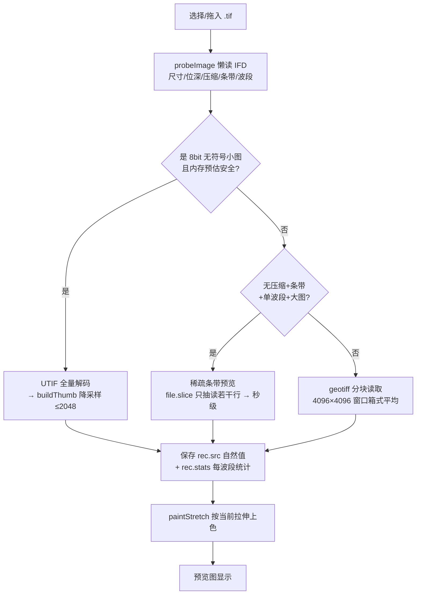
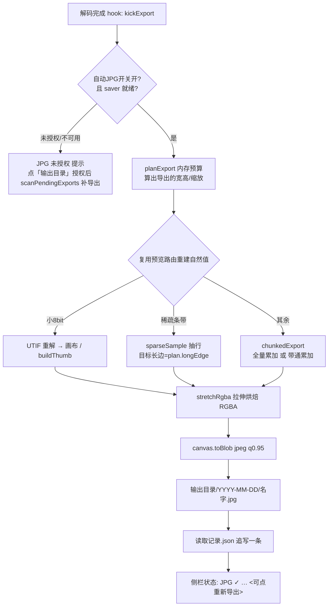

# tif_viewer「读 tif → 自动生成 JPG」背景知识

> 目标读者：对遥感影像和浏览器内部机制不熟悉、想理解 [tif-viewer.html](../../tif_viewer/tif-viewer.html) 这段新增流程的人。
> 阅读顺序建议：**先看第 1 节「一句话」→ 再看第 2 节背景概念 → 第 3、4 节流程图 → 第 5 节内存账本 → 第 6 节对照源码**。

---

## 1. 一句话总结这次改动做了什么

> 每次成功读取一张 `.tif` 后，**自动**把当前"拉伸"显示效果下的画面，**重新用高分辨率解码一遍**，
> 烘焙成一张高质量 JPG（长边默认 8192，≈原始 1/3），**写到本地你选好的一个目录里**，
> 按**读取当天**建子文件夹（`输出目录/YYYY-MM-DD/`），并在当天一个 `读取记录.json` 里追写一条读取记录。

输出结构：

```
输出目录/
└── 2026-08-28/                 ← 按读取日期分子目录（dateDirName()）
    ├── GF07A03.jpg             ← 同名 jpg，重名自动 _2 / _3（uniqueJpgName）
    └── 读取记录.json            ← 每次读取追写一条 {文件名,大小,尺寸,读取时间,jpg,拉伸,质量,实际尺寸}
```

为什么强调"重新解码一遍"而不是"把预览图放大"？
因为**预览图为了省内存做了降采样**（稀疏条带路径长边 8192≈原始 1/3，其余路径 2048），放大超过预览分辨率只会得到糊图。
"尽可能保留细节" = 用 **高分辨率 + 高画质(0.95) + 当前拉伸** 单独再解一次，而不是预览图的简单放大。

---

## 2. 需要的背景概念（按重要程度排列）

### 2.1 TIFF 文件结构：IFD 标签、条带/瓦片、位深、波段

一张 `.tif` 不是"一行行像素"那么简单，而是一个**标签字典 + 像素数据块**：

- **IFD（Image File Directory）**：文件头附近的一张"属性表"，每个条目是一个标签(Tag)。
  关键标签：
  | Tag | 含义 |
  |---|---|
  | 256 / 257 | 宽 W / 高 H |
  | 258 | 每样本位数 bits（8=1字节，16=2字节，32=4字节）|
  | 259 | 压缩方式（1=无压缩，5=LZW，8=Deflate，50000=ZSTD…）|
  | 262 | 光度解释 photometric（0=白为0→需反相，1=黑为0，2=RGB）|
  | 273 / 279 | 各条带(strip)的字节偏移 / 字节数 |
  | 278 | 每个条带多少行（rows-per-strip，遥感大图常=1）|
  | 277 | 每像素样本数 spp（1=单波段，3=RGB）|
  | 322 / 323 | 瓦片(tile)宽高（存在即按瓦片分块存储）|
  | 339 | 样本格式 sampleFormat（1=无符号整数，2=有符号，3=浮点）|

- **条带(strip) / 瓦片(tile)**：像素数据并不是整块连续存放，而是按条带（若干连续行）或瓦片（方块）切块。
  - 遥感真值大图常见的布局：**无压缩 + 条带1行** → 每行像素独占一个连续字节段，可以直接按 `文件偏移` 精确切片读到**任意一行**。
  - 这正是 `parseStrips()` + `sparseSample()`（稀疏采样）能吃下的结构。

- **位深 / 波段 / 样本格式**：
  - 8bit：每像素 0~255（和普通照片一样）。
  - 16bit：每像素 0~65535，**遥感原始数据绝大多数是这个**（辐射分辨率更高，但屏幕显示不了，需要拉伸）。
  - 单波段(1 band)：卫星影像常只存 1 个通道，靠拉伸上色显示。
  - 样本格式 3 = 浮点：可能带负值/小数（如大气校正后的反射率），更需要拉伸。

- **BigTIFF**：文件偏移量用 8 字节（classic 用 4 字节）。>4GB 的大文件基本是 BigTIFF。`parseStrips()` 和 `tiffTags()` 都同时兼容 classic 与 BigTIFF。

> **小结**：程序读一张 tif，第一步永远是"读 IFD 标签"来了解它是什么货色（多大、几比特、什么压缩、条带还是瓦片、是否要反相），再决定怎么解。这一层叫 `probeImage()`。

### 2.2 为什么遥感大图会"解不动"：浏览器三道硬墙

浏览器（Chromium/Edge）对内存有几条硬性上限，设计里几乎每个数字都是在跟它们周旋：

| 上限 | 数值 | 影响 |
|---|---|---|
| **单次 ArrayBuffer 分配** | 实测约 **2GB** | `new Float64Array(16384²)` ≈ 2.1GB → 直接分配失败 |
| **Canvas 面积** | **268,435,456 像素**（=16384²） | 超过就画布报错 |
| **Canvas 边长** | 65535 | 再大直接拒绝 |
| 页面总内存 | 64GB 机器够用，但每张图要按上面几档控制 | — |

所以"把一张 1.1GB、2 万×2 万、16bit 的 tif 全读进内存"这条路**根本走不通**，必须：

1. **要么不读全**（稀疏采样：只抽样读少数几行）；
2. **要么分块读**（geotiff 库按 4096×4096 小窗口切片读）；
3. **要么降采样**（把 N×N 像素平均成 1 个预览像素，见 2.4）。

### 2.3 显示拉伸（ENVI 风格）——为什么 16bit 图必须拉伸

16bit 数据范围 0~65535，但屏幕只能显示 0~255 的亮度。直接 `值/256` 映射通常**糊成一片**（数据集中在某一段）。
所以需要一个**直方图拉伸**：先统计整图的 min/max/直方图/百分位，再把原始值映射到 0~255。

本程序支持 5 种（工具栏下拉，代码 `stretchMap()`）：

| 模式 | 映射公式 | 用途 |
|---|---|---|
| linear | `(v-min)/(max-min)*255` | 线性铺满全范围 |
| 2% linear | 用 2%/98% **百分位**代替 min/max | 抗个别极端像元（坏点/云），最常用 |
| sqrt | `sqrt(t)*255` | 压暗部提亮，中低值更分明 |
| log | `log(1+t)/log2 *255` | 比 sqrt 更强的提暗部 |
| equalize | 用**累计直方图(CDF)**做查表 | 直方图均衡，把分布摊平 |

关键设计：解码时保存的是**未拉伸的原始值**（Float32 数组 `rec.src`）+ 每波段统计 `rec.stats`，
显示时再用当前模式算一次映射。这样**切换拉伸不用重新读文件**，也意味着**导出的 JPG 就是"当前拉伸模式"下的样子**（导出时调用同一个 `stretchRgba()`）。

### 2.4 降采样（下采样）：两种方式

要把一张 2万×2万 的图缩到 2048 预览，有两条路：

- **箱式平均（box filter）**：把每 k×k 个源像素求和取平均，成为一个预览像素（`chunkedCollect` / `bandPassCollect` 的做法，用 Float64 累加器累加再除计数）。信息保留最诚实，但需要把所有源像素都读一遍。
- **稀疏采样（sparse）**：只按间隔抽读第 0、k、2k… 行/列，没读到的就直接跳过（`sparseSample` 的做法，用 `file.slice()` 直接按字节切）。读的量只有文件的几十分之一，**秒级**，适合"无压缩+条带"结构的巨图。

> 预览用稀疏采样（快），导出 8192（≈1/3）也复用同一机制（因为这种结构的文件不需要金字塔，任意窗口都能字节切片）。

### 2.5 JPEG 是什么，以及"保留细节"的真实含义

JPEG 是 **8bit 有损** 压缩格式。也就是说：
- 16bit 的辐射细节（65535 个灰度级）**物理上进不了** 8bit 的 JPG；
- 有损压缩还会带来轻微块状/振铃伪影。

所以这里"尽可能保留细节"的取舍是：**分辨率尽量高（8192，≈原始 1/3）+ 画质尽量好（q0.95）+ 拉伸模式可选**。
如果业务上真的需要无损 16bit 中间产物，应该导 **16bit PNG/TIFF**，但那是另一条路了（本功能暂定 JPG，因为业务要的是"能直接看图"的中间产物）。

### 2.6 文件系统访问 API（FS Access API）+ IndexedDB

浏览器出于安全，网页**不能静默写任意磁盘路径**。Chromium/Edge 提供了一套"需要一次用户点击授权"的方案：

1. `showDirectoryPicker()`：用户**点按钮**时弹系统目录选择框，选一次目录后拿到一个 `FileSystemDirectoryHandle`（目录句柄）。
2. 句柄是**可序列化**的 → 存进 **IndexedDB**（浏览器内置小型数据库），刷新页面后取出来，**不用再选目录**。
3. 每次用前用 `queryPermission()` 查权限，`prompt` 状态时点按钮走 `requestPermission()` **重新授权同一目录**（避免重新选）。
4. 授权后：`getDirectoryHandle('YYYY-MM-DD', {create:true})` 建日期子目录 → `getFileHandle(name,{create:true})` 建文件 → `createWritable()` 拿写入流 → `write(blob)`。
5. 这套 API 只有 Chromium 系有。**Firefox/旧浏览器**没有 → 程序自动降级为"每次下载到下载文件夹"（`downloadSaver`）。

> 这就是为什么工具栏那个按钮叫「输出目录: 未授权」——**必须点它授权一次**，之后每读一张 tif 就静默写盘，不再打扰你。

---

## 3. 解码流水线（读 tif → 屏幕预览）——现状回顾



三条路（`activate()` → `decodeGeoTiff()` / `decodeUtif()`）：

- **小 8bit 图** → UTIF 一次性全解（快，页面短暂冻结）。
- **无压缩 + 条带 + 单波段 + >1亿字节的大图** → 稀疏条带（你机器上 GF07A03/KF02B04 那类真实文件走的这条路）。
- **其余一切**（16bit/浮点/多波段/压缩/瓦片）→ geotiff 按窗口分块读，边读边出进度条。

> 无论走哪条路，最终都产出**同一个规格的数据**：`{ src: Float32自然值, stats, invert, W, H }`，统一下一步显示/导出。这就是"统一接口"的好处。

---

## 4. 导出流水线（读 tif → JPG）——本次新增



几个关键点：

1. **串行队列**：`exportQueue` + `pumpExport()`。多张图同时高分辨率解码会撑爆内存，所以**一次只导一张**，导出不弹遮罩、不阻塞浏览。
2. **导出 ≠ 预览**：预览是 2048 长边的；导出单独按 8192（≈1/3）重解一遍（`collectForExport()` 与预览同路由，只是目标长边不同）。
3. **带通累加器**：8192² 单波段若用全量 Float64 累加器 = 536MB > `BAND_ACC_LIMIT` 4e8 → 仍用**按输出行带分段累加**（`bandPassCollect`），一段 256 行只占约 16MB；若把 `JPG_MAX` 改回 16384，全量累加器会到 2.1GB > 2GB 上限，更必须走带通。
4. **失败自动降档**：若 Edge 在画布面积/内存上限上拒绝（`RangeError/allocation` 等），自动把导出上限降到 **4096** 再试一次（`doExportJob` 的 catch 分支）。
5. **重新导出**：点侧栏 `（重新导出）`，用**当前拉伸模式**重烘焙一次（`reExportJpg`），适合"先 linear 导出，后来想看 2% 线性效果"。
6. **E2E 钩子**：`window.__viewer` 暴露子流程，可注入假 saver，方便无头测试（`showDirectoryPicker` 无法被脚本驱动，只能注入替身）。

---

## 5. 内存账本（为什么是 16384 / 8192 / 2.4e9 这些数字）

`planExport(W, H, nb)` 就是在算这个账：

| 项 | 16384² 单波段 | 8192² 三波段 |
|---|---|---|
| 像素数 px | 268,435,456（= 画布面积上限） | 67,108,864 |
| src 自然值 Float32 | px×nb×4 = **1.07 GB** | px×3×4 = 0.8 GB |
| RGBA 烘焙 | px×4 = **1.07 GB** | px×4 = 0.27 GB |
| JS 可见总分配（≈px×(nb×4+4)） | 2.15 GB ≤ **预算 2.4e9** ✓ | 1.07 GB ✓ |
| 若用全量 Float64 累加器 | px×8 = 2.1 GB **>2GB 上限 ✗** | — |
| 带通累加器（256 行×宽） | 256×16384×8 ≈ **33 MB** ✓ | — |
| canvas 位图（不可见但真实） | 1.07 GB | 0.27 GB |

结论：
- **单波段默认 8192**（≈原始长边 1/3，用户需求），稳妥避开画布面积上限；若把 `JPG_MAX` 改回 16384 也能跑（正好卡面积上限，靠带通累加压内存）。
- **多波段封顶 8192**（`MULTI_BAND_LONG`）——3 波段 16384 的 src 就有 3.2GB，必爆。
- **预算不够自动降档**：`planExport` 里 `scale *= 0.9` 循环缩，直到 `px*(nb*4+4) ≤ EXPORT_BUDGET`。
- 低内存机器想更保守：把 `EXPORT_BUDGET`（默认 2.4e9）调小即可。

---

## 6. 对照源码（tif-viewer.html 关键函数定位）

| 概念 | 函数 | 说明 |
|---|---|---|
| 常量/上限 | 顶部 `JPG_MAX` `EXPORT_BUDGET` `CANVAS_AREA_MAX` … | 所有魔数都在这 |
| 读 IFD 属性 | `probeImage()` / `tiffTags()` / `parseStrips()` | 摸清文件结构 |
| 拉伸映射 | `stretchMap()` + `computeStats()` | 5 种拉伸 + 直方图/百分位统计 |
| 渲染上色 | `stretchRgba()` → `paintStretch()` | 自然值 → RGBA |
| 分块读取 | `chunkedCollect()` / `bandPassCollect()` | 箱式平均；大图走带通 |
| 稀疏采样 | `sparseSample()` / `sparseCollect()` | 无压缩条带字节切片 |
| 解码分派 | `activate()` | 决定走 UTIF / 稀疏 / 分块 |
| 内存预算 | `planExport()` | 导出分辨率规划 |
| 导出收集 | `collectForExport()` | 复用预览路由重解 |
| 烘焙+写盘 | `exportToJpg()` | 拉伸→canvas→blob→写文件→写日志 |
| 落盘层 | `fsIO` / `downloadSaver` / `getSaver()` | FS API + IndexedDB 持久化 + 降级 |
| 导出编排 | `kickExport` / `exportQueue` / `doExportJob` | 串行 + 失败降档 + 重新导出 |
| 挂钩点 | 三处 `kickExport(rec)`（稀疏/分块/UTIF 完成处） | 解码成功即自动触发 |

**建议的阅读路径**（从用户操作出发）：`DOMContentLoaded` 里的按钮接线 → 点「选择文件」→ `openFiles` → `activate` → 走一条解码路 → 完成处 `kickExport` → `collectForExport` → `exportToJpg` → `fsIO.writeJpg` → `读取记录.json`。

---

## 7. 常见问题

- **为什么首次必须点「输出目录」？** 浏览器规定写盘必须有一次用户手势授权；授权句柄存 IndexedDB，之后同目录一直有效。
- **JPG 是 16bit 吗？** 不是，JPG 只有 8bit。16bit 细节只能在**拉伸后的显示效果**层面尽可能保留（高分辨率+高画质+可选拉伸）。
- **为什么导出重新读一遍文件而不是复用预览？** 预览有降采样上限（稀疏 8192 / 其余 2048），细节不够；导出按目标长边 8192 重解一次（稀疏路径很便宜，分块路径会重新读文件，可接受）。
- **Edge 闪退/报 allocation 失败？** 那是画布面积/内存极限踩雷，程序会自动降到 4096 重试；还不行就把 `EXPORT_BUDGET` 调小。
- **想改默认导出上限？** 改顶部常量 `JPG_MAX`（默认 8192）即可，无需动其他逻辑。
