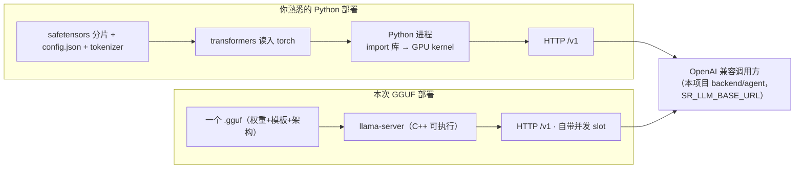

# 本地 LLM serving：llama.cpp / GGUF 生态名词科普

> 日期：2026-09-09 · 状态：草稿
> 目标读者：已熟悉 LLM 本身（prefill/decode、function calling、context），但此前部署经验只有
> 「Python 装库就跑」（transformers/vLLM 之类），想读懂 [qwen3.8plan.md](../planning/qwen3.8plan.md)
> 与 [agent-llm-deployment.md](../planning/agent-llm-deployment.md) 里部署侧名词的人。
> 阅读顺序建议：**先看 §1 一句话 → §2「两个生态」（核心心智模型）→ §3 名词分层 → §4 选型对照 → §5 FAQ**。

---

## 1. 一句话总结

**llama.cpp 在这个部署里 = 推理引擎 + 服务进程**，顶替掉你以前「pip 装库 → import 起来 → 开 HTTP」那整坨。
本项目最终在 CentOS7 内网机上选它，是因为新版 vLLM / torch 的 Linux 安装包要求 **glibc ≥ 2.28** 而 CentOS7 只有 2.17，
Python 生态装不上去；而 llama.cpp 是 **C++ 编译产物，只认显卡驱动**，所以这条路反而最干净——不是将就。

本次选型定案（2026-09-09，详见 [agent-llm-deployment.md](../planning/agent-llm-deployment.md)）：

> 模型 = Qwen3.8-27B **基础版**（不是社区 Uncensored/Abliterated 变体）· 量化 = **GGUF Q4_K_M ≈ 16.8~17GB**
> · 运行时 = **llama.cpp llama-server**（本机 CUDA 编译）· 资源 = 固定 1 张 3090（其余给 Slurm/SR）
> · 接入 = OpenAI 兼容 `/v1`，后端 `SR_LLM_BASE_URL` 指过去即可，代码零改动。

---

## 2. 需要的基础概念（按重要程度排列）

### 2.1 两个生态（最重要的心智模型）

LLM 部署工具分两大家族，**权重格式与引擎是互相绑定、不通用的**；两边对外都讲 OpenAI 兼容 HTTP，所以上层代码不感知差异。

| | Python/torch 生态 | GGUF 生态 |
|---|---|---|
| 权重格式 | safetensors 分片（原生）→ GPTQ / AWQ 等量化 | **GGUF**（含 Q4_K_M 等档位） |
| serving 引擎 | vLLM / SGLang / TGI / transformers | **llama.cpp**（llama-server）/ Ollama（包了一层 llama.cpp） |
| 运行时语言 | Python 进程 + torch 里的 C++/CUDA | 纯 C++ 可执行文件，无 Python |
| 安装方式 | pip 预编译 wheel（glibc/驱动要求随版本涨） | 下载或源码编译一个二进制 |
| 能跑 Qwen3.8-27B 的代价 | 要求 OS/glibc 很新（这台 CentOS7 不满足） | 只要驱动够新 + 编译一次即可 |
| 适合 | 多用户高并发 / 长上下文大吞吐 | 单机低运维 / 显存敏感 / 受限 OS |

> 两个生态都通过 `name + arguments(json)` 支持 function calling；差异在解析可靠性上（Qwen3.8 太新，两个生态的
> 多轮工具调用都还有打磨空间，见 §5 FAQ）。

### 2.2 引擎层名词（决定"用什么程序跑"）

| 名词 | 是什么 | 类比 | 本项目备注 |
|---|---|---|---|
| **llama.cpp** | C/C++ 写的推理引擎项目，GGUF 生态的原生引擎 | vLLM 的「C++ 内核版」 | 只吃 GGUF；CPU/GPU 都能跑 |
| **llama-server** | llama.cpp 里的可执行文件，启动即变 HTTP 服务器，吐 OpenAI 兼容 `/v1` | 「本地版 OpenAI」 | 后端连的就是它；`llama-cli`/`llama-mtmd-cli` 是无 HTTP 的命令行版 |
| **vLLM / SGLang** | Python 生态 serving 引擎（torch 上再包一层 + 连续批处理） | 多用户高吞吐时的首选 | 这台 CentOS7 装不上（glibc），故弃 |
| **Ollama** | 给 llama.cpp 套「开箱即用」外壳 | 更傻瓜的 llama.cpp | 自带的 llama.cpp 版本滞后，跑不了新 arch，故弃 |

### 2.3 权重格式层名词（决定"文件长什么样"）

| 名词 | 是什么 | 备注 |
|---|---|---|
| **GGUF** | 一个**容器文件**：量化权重 + tokenizer + 对话模板 + 架构名全部并成一个文件 | 相当于「safetensors 分片 + config.json + tokenizer.json」的合体 + 量化版；llama.cpp 只看这一个文件就知道怎么跑 |
| **safetensors / BF16 原版** | 官方仓库给的原生权重（Qwen3.8-27B ≈ 55.6GB 拆 18 片，float16） | 你以前 `from_pretrained` 加载的就是它 |
| **mmproj** | 单独打的「视觉塔」小 GGUF（~0.9GB）：图像编码器 + 投影层 | Qwen3.8 原生多模态，但**看图功能是选装**——不带它纯文本跑；带它（`--mmproj`）后 `/v1` 能收 `image_url` |

### 2.4 量化档位层名词（决定"压多狠、叫什么名字"）

**核心：量化方案和引擎绑定，两个生态不通用**；名字里的体积是结果不是参数量。

| 名词 | 归属生态 | 说明 |
|---|---|---|
| **Q4_K_M** | **GGUF/llama.cpp** | 名字拆解：`Q4`=权重平均约 4bit；`K`=K-quant（按层敏感度给不同张量 2~8bit 混合精度）；`M`=K-quant 的中间细档（另有 `_S`小/_L大）。≈16.8GB 是最终体积 |
| **AWQ-INT4 / GPTQ** | Python/torch | 同是约 4bit 但位排布不同，**不能喂给 llama.cpp** |
| **NVFP4** | NVIDIA Blackwell/RTX50 | FP4 是 Blackwell 才有的硬件格式；3090（Ampere）无硬件加速，等于废 |
| **FP8** | NVIDIA Hopper+ | Ampere 无 FP8 tensor core，硬跑很慢 |
| **EXL3 / bpw** | EXLlamaV3 引擎 | `3.5bpw`=平均每权重 3.5bit；但不支持 Qwen3.8 的 `qwen35` 混合架构 |
| **MLX** | Apple Silicon | 本环境用不上 |
| **GSQ-RCO / Flash / DFlash2 / Ridge / imatrix** | 都是 GGUF 的**花式子变体**/构建工艺 | 质量参差；本项目用标准 Q4_K_M，别被名字带偏 |

### 2.5 部署运行时名词（llama-server 启动参数小词典）

| 名词 | 含义 |
|---|---|
| **arch = `qwen35`** | 模型在 llama.cpp 里的注册名。混合注意力：48 层线性（Gated DeltaNet）+ 16 层全注意力 → **KV 缓存只有普通 27B 的约 1/4**，单张 24GB 卡也能开 32K~64K 上下文 |
| **b10360（版本号）** | llama.cpp 用 `b+数字` 定版本。Qwen3.8 太新，**必须 ≥ b10360（2026-08 起）的版本才认识这个 arch**，旧版直接拒绝加载 |
| **编译 CUDA 后端 / nvcc / cmake** | nvcc = NVIDIA 的 C++ 编译器（CUDA toolkit 自带）；cmake = 构建工具。`-DGGML_CUDA=ON` 让编出的 llama-server 带 3090 CUDA 加速——等于把 pip 替你做的「预编译」自己做一遍，一次即可、之后是普通进程 |
| **`--parallel 4`（slot）** | 4 个并发槽位；权重在显存只常驻一份，槽位轮流吃它 → 匹配「≤3~4 路 agent 并发」 |
| **`-ngl 999`** | 尽量把层全部放 GPU（999 是「能放都放」的惯用写法） |
| **`--jinja`** | 强制用模型自带 Jinja 对话模板。Qwen3.8 模板特殊（thinking/工具轮衔接），不开会格式乱、多轮工具调用出错 |
| **`-c 32768`** | 上下文窗口长度（token） |
| **`CUDA_VISIBLE_DEVICES` + Slurm 剔除** | 让 llama-server 进程只见/只用指定一张卡；Slurm 配置把该卡从可分配集摘掉，SR 作业才不会排到它头上抢算力 |

---

## 3. 流程总览

### 3.1 两种部署链路对比（mermaid）



### 3.2 内网机部署流水线（到现场执行顺序）

```
拷 2 个 gguf 到 /DiskArray/models/Qwen3.8-27B/
   → 编 llama.cpp（cmake -DGGML_CUDA=ON，需 nvcc）或拉预编译二进制
   → CUDA_VISIBLE_DEVICES=<卡号> llama-server -m Q4_K_M.gguf
        --mmproj mmproj-F16.gguf --jinja -c 32768 -ngl 999 --parallel 4
        --host 127.0.0.1 --port 8001        （systemd 托管）
   → 后端 SR_LLM_BASE_URL=http://127.0.0.1:8001/v1 + SR_LLM_MOCK=0
   → python -m backend.agent "…" 跑工具剧本验收
```

---

## 4. 关键取舍（对照 qwen3.8plan.md §三 的选型指南）

[qwen3.8plan.md](../planning/qwen3.8plan.md) §三 给的是一般性指引，落到本项目硬件（**4× RTX 3090 = Ampere**）要修正：

| 文档建议 | 本项目结论 | 原因 |
|---|---|---|
| 「新显卡首选 NVFP4」 | ❌ 不用 | NVFP4 = Blackwell/RTX50 的硬件格式；3090 无 FP4 加速 |
| 「高显存机器选 FP8」 | ❌ 不用 | 3090 无 FP8 tensor core |
| 「老显卡选 EXL3 / AWQ」 | ❌ EXL3 不用；AWQ 可用但 serving 被 OS 卡 | EXL3 不支持 `qwen35` 混合架构；AWQ 要 vLLM 跑，而 vLLM 装不上 CentOS7 |
| 「GGUF 仅 CPU/低显存 GPU」 | ✅ 恰恰是 24GB 卡的主选 | 见 §2.1：只有 GGUF/llama.cpp 这条链在 CentOS7 上可落地 |
| 「Uncensored / Abliterated 多模态变体」 | ❌ 不选 | 去对齐微调常连带伤到 function-calling 可靠性；工作台 agent 应选基础版 |

> 推论（备忘）：对 3090 这种 Ampere 卡，**GGUF(Q4_K_M 系) + llama.cpp 是唯一同时满足
> 「模型可跑 + 工具调用 + OS 可装 + 显存够」的组合**。

### 4.2 反伪要点 + 仓库选择（2026-09-09 已核实）

- **看账号，别信名字**：搜「Qwen3.8-27B GGUF」会得到大量 fork/蹭名仓库（带 `UD`/`uncensored`/`padthai`/`saor` 等标签）。采购对象 = **官方账号仓库本身** `unsloth/Qwen3.8-27B-GGUF`；社区派生（本文件 §6 列的两份抓取清单）不可审计，去对齐变体还伤 function-calling。
- **`UD` 语义双关**：unsloth 官方文件前缀 `UD-` = **Dynamic 3.0 量化**（纯 PTQ：逐层动态选档 + imatrix 校准），**不是 Uncensored**；社区却常把 `ud` 当 uncensored。自证法：官方包同时有 `UD-*` 和普通 `Q4_0/Q8_0` 文件共存——若 UD 真是"去对齐"不会与 base 文件同仓打包。下载前以仓库 README 的图例为准。
- **24GB 单卡推荐档（unsloth 口径）**：`UD-Q4_K_XL` ≈17.6GB；16GB 卡用 `UD-IQ4_XS`；更高精度档 `Q5_K_S/XL` 余量更小。
- **tied embeddings 陷阱**：Qwen3.8 的 embedding 与 lm_head 绑定 → llama.cpp 必须把 embedding 载入显存，**文件体积 ≈ 实际显存占用**；选档别贴 24GB 上限太近，否则 `--parallel` 多槽 + 长上下文的 KV 会放不下。
- 运维评估（可复现 / 可升级 / 上游有人修）与"换引擎不换文件"要点：见本文件 §2.1、§2.5 与 §4 表；「带哪几个到内网」清单见 `qwen3.8download.md` §下载与带到公司决策。

---

## 5. 常见问题（FAQ）

**Q1：为什么不能「pip 装库就跑」，非要编 C++？**
llama.cpp 生态不发布 Python wheel；它给你引擎源码，要你在目标机上编一次（或用 GitHub 预编译二进制）。
好处是产物是纯 C++ 进程，不依赖 Python/glibc 版本——这正是 CentOS7 上它能活、vLLM 活不了的原因。

**Q2：想图省事直接 `pip install llama-cpp-python` 行不行？**
`llama-cpp-python` 是 Python 绑定，本质仍是编好的 llama.cpp；但它：
① 默认可能没带 CUDA（CPU 版，27B 慢到不可用）；② 绑定里封的 llama.cpp 版本滞后，可能还不认识 `qwen35`。
结论：本项目跑**独立 llama-server**（进程 + HTTP），比 Python 绑定更可控、版本更新。

**Q3：GGUF 和 AWQ/GPTQ 能互换吗？**
不能。两者位排布不同且引擎锁定：GGUF ↔ llama.cpp；AWQ/GPTQ ↔ torch/vLLM。换生态 = 换权重文件。

**Q4：不带 mmproj 会怎样？**
纯文本照常；只有传图片给 `/v1` 时才会失败。所以可以先用文本验收，mmproj 后补（镜像随时能下）。

**Q5：工具调用（function calling）可靠性有风险吗？**
有。Qwen3.8 太新，社区实测在部分 runtime 上**多轮工具调用、thinking 与工具轮衔接**还有坑。
缓解手段（按顺序试）：`--jinja` 必开 → 必要时 `enable_thinking:false` / `reasoning_effort:low` 提速并简化解析 →
本项目 M1 loop 自带容错（工具参数错会回喂修正、不盲重试）能兜住一部分。最终以 §1 定案里的
`python -m backend.agent` 工具剧本验收为准。

**Q6：以后想升级到 vLLM / 多用户高吞吐怎么办？**
需要 OS 升到 glibc ≥ 2.28 的发行版（或换一台非 CentOS7 机器），再把权重换成 vLLM 侧量化（AWQ/FP8 等）。
接口层不变，仍是 OpenAI 兼容 `/v1`，后端零改动。详见 [agent-llm-deployment.md](../planning/agent-llm-deployment.md) §5。

---

## 6. 关联文档

- 部署选型定案：`docs/planning/agent-llm-deployment.md`
- 模型量化调研表（含误导性 §三，对照本文 §4）：`docs/planning/qwen3.8plan.md`
- UD 文件清单 + 「带哪个到内网」决策（本文 §4.2 的落地版）：`docs/planning/qwen3.8download.md`
- 社区 fork/去对齐变体警示样例（对照本文 §4.2「看账号」）：`docs/planning/qwen3.8unsloth-fork-download.md`
- 内网机环境与落地手册：`docs/status/real-machine-bringup.md`
- 后端接入方式（`SR_LLM_BASE_URL` 等 env）：`backend/config.py` · `backend/agent/loop.py`
