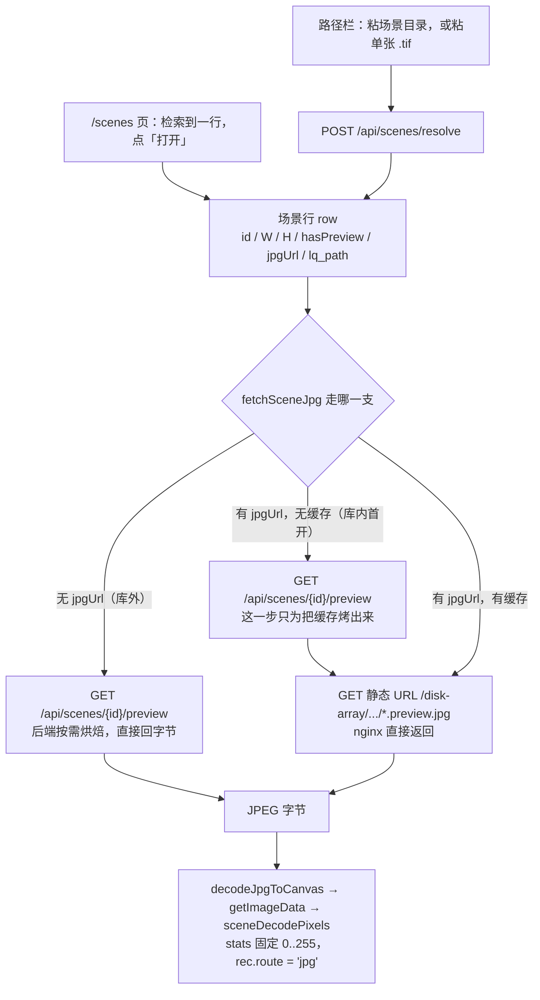
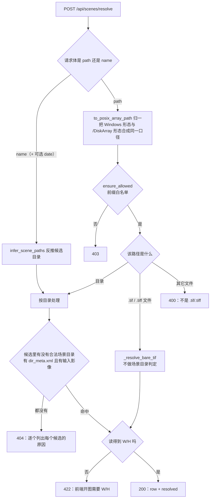
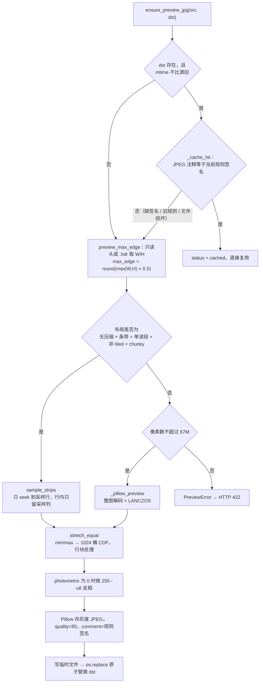

# 盘阵场景预览烘焙管线 背景知识

> 2026-09-17 / 已定（2026-09-20 增补：§4.1 `rasterPreview`、§4.8 落点共用、§4.9 产物急烤）
>
> **目标读者**：要改这条链路上任何一段的开发者（后端 `preview_jpg.py` / `api/app.py`，前端 `api.ts` / `stores/viewer.ts` / `stores/scenes.ts`）。
> **一句话摘要**：盘阵场景不把原始 TIF 交给浏览器，而是在源文件同目录先烤一张降采样（各边 ÷2…÷32 可选，2026-09-19 起由工具栏滑块定）、直方图均衡过的灰度 JPEG，浏览器读那张 JPEG。2026-09-20 起多两件事：作业转 COMPLETED 时服务端**顺手把产物那一份烤掉**（§4.9），显示件 jpg 在同目录有位更清晰的栅格时**改从栅格烤**（§4.1 末、§4.8）。
> **阅读顺序**：先看 §3 的两张流程图建立整体印象，再按需读 §4 的对应小节；§5 收录了改这条链路时最容易判断错的几个点。
>
> **范围**：本文覆盖「用户给出一个盘阵路径或文件名」到「图像画到画布上」的完整链路。
> **不覆盖**：本地文件路径（`选择 TIF…` / 拖入）的 UTIF / geotiff 分块 / 稀疏条带三路分派——那条路仍然在浏览器里直接读源 TIF，与本文的烘焙产物无关，两条路的常量也不共用。

---

## 1. 一句话总结

浏览器只拿一张服务端预先烤好的 JPEG；烘焙在源文件所在目录就地完成并就地缓存，缓存是否可复用由写在 JPEG 注释里的**规则签名**决定，不由修改时间决定。

---

## 2. 需要的背景概念（按重要程度排列）

### 2.1 为什么浏览器不能直接读盘阵原始 TIF

浏览器有两项硬上限：单次 `ArrayBuffer` 分配约 2GB、Canvas 面积上限 16384²。盘阵上的真实场景是 1.1~1.8GB、2.4 万像素级，像素数据本身约 `W×H×2 ≈ 1.2GB`，转 RGBA 后约 2.4GB，两者都在上限之外。因此浏览器侧不存在「整幅解码」这个选项。

（历史方案 `HttpSource + nginx Range` 曾计划让浏览器按需 Range 读 TIF 字节，已废弃。现在盘阵路径完全不碰原始 TIF 字节。）

### 2.2 真实盘阵 TIFF 的布局

已确认的形态是：**无压缩（`compression=1`）+ 每行一条带 + 单波段**，且多数场景目录带一个 ENVI `.hdr`（含 `samples` / `lines` / `bands`）。这个布局是稀疏采样可行的前提——知道每行的条带偏移后，就能只读需要的那些行，而不必解码整幅。

不满足该布局的文件（压缩、tiled、多波段、planar≠1）走 Pillow 兜底，且只对像素数不超过 67M 的小文件开放。

### 2.3 稀疏采样的语义

目标像素 `(i, j)` 取源图 `(round(i*(H-1)/(ph-1)), round(j*(W-1)/(pw-1)))`。分子分母都用 `n-1`，即**端点对齐**：首行取首行、末行取末行。若改成 `ceil` 之类的写法，最右列/最下行会重复取样，在图上表现为边缘条纹。

缩放比 `ps = min(1, max_edge / max(W, H))`。本文这条链路传入的 `max_edge = round(max(W,H) / div)`，
得到长宽各 1/`div`（2026-09-19 之前 `div` 固定为 2，现由滑块定，见 §4.4）。

### 2.4 拉伸

16bit 影像值域 0~65535，屏幕只有 0~255，显示前必须把「大多数像素所在区间」映射到 0~255。

- **2% 线性**：取 2% / 98% 分位作为两端。
- **直方图均衡**：取整幅 min/max（不是分位），建 1024 桶累积直方图，按 CDF 重映射。

本链路用直方图均衡。两侧（后端 `stretch_equal`、前端 `stretchMap(mode='equal')`）是逐式镜像的两份实现，见 §4.5。

### 2.5 缓存签名

烘焙产物就地覆盖，文件名不随规则变（`<stem>.preview.jpg`，拖入那条是 `<stem>_preview.jpg`）。因此「这份缓存还符不符合当前规则」不能靠文件名区分，靠的是写在 JPEG 注释段里的一个 ASCII 串：

```
srprev:v3:div4+equal:q85
        │   │   │        └ quality → 改 PREVIEW_JPG_QUALITY 要 bump
        │   │   └ 拉伸规则（现只有 equal）
        │   └ 档位 → 改档位集合/换算要 bump（2026-09-19 加）
        └ 规则版本号 PREVIEW_RULE_VERSION
```

Pillow 用 `Image.save(..., comment=...)` 写、`Image.open(...).info["comment"]` 读。

---

## 3. 流程总览

### 3.1 端到端



两条入口的差别只在 row 从哪来（`GET /api/scenes` 检索 vs `POST /api/scenes/resolve`），之后的取字节与显示完全共用。

### 3.2 resolve 的分派与结果码



`name` 分支的日期可省略，由后端从文件名的 14/8 位成像时间戳里取；前端不重复实现这套正则（命名规则的唯一真源在 `backend/pathguard.py`）。

反推可能得到多个候选，逐个检查：先确认是目录，再确认 `scene_search.input_scene_path` 认得出输入影像；认不出时按原因分别说清——目录名就是完整生产名时是「缺 `dir_meta.xml`」，否则是「目录里没有输入影像」，**粘错了层**（日期目录 / 卫星型号层 / 段级目录 / 场景目录内部的子目录 / 名字不是生产名）则各报「差在哪一层」，见 [api-contract.md](../planning/api-contract.md) 的 404 一段。全部候选都不中才 404，并把每个候选的原因一并写进 `detail`——不静默换一条路径。

### 3.3 烘焙与缓存判定



---

## 4. 关键实现与设计取舍

### 4.1 场景行 row 的字段语义

同一个 row 里混着三类信息，改动时最容易弄混：

| 字段 | 含义 | 真值来源 |
|---|---|---|
| `W` / `H` | **元数据尺寸**，即源图尺寸，不是 JPEG 的像素尺寸 | `scene_dims`：优先 `.hdr`，否则 TIFF 头探测 |
| `hasPreview` | 缓存文件**此刻在不在** | `jpg_path.is_file()`。库内库外都填真值 |
| `previewDiv` | 盘上那份缓存**是各边除以几烤的**（2026-09-19 新增）。读不出戳 → `null` | `preview_div_of()` 读 JPEG 注释戳 `div<N>`，只读头不解像素 |
| `jpgUrl` | nginx 静态 URL，**只有源在 `SR_SCENES_ROOT` 之下时才有值**；库内的库行给的是「缓存该在的位置」，文件可能还没生成 | `rel_url()` |
| `rasterPreview` | **只读**，2026-09-20 新增：描述同目录那份同名栅格（`{rel, id, name, rasterW, rasterH, jpgW, jpgH, hasPreview, previewDiv, jpgUrl}`）。**只有源是 `.jpg/.jpeg` 的行非空**，其余行恒 `null`；没同名栅格、或两侧尺寸任一侧读不出 → 同样 `null`。`jpgUrl` 只在栅格落在 `SR_SCENES_ROOT` 之下才给。**它不参与上面那三行的语义** —— 上面的 `hasPreview`/`jpgUrl`/`previewDiv` 锚在显示件 jpg 自己身上，栅格的状态单独放这里 | `_raster_preview()` |
| `lq_path` | 提交 SR 时用的目录。**这是「能不能提交」的判据** | 见 §4.2 |
| `sr_capable` | 与 `lq_path` 同源同真假的显式标志 | 见 §4.2 |

要点：`jpgUrl` 有值不等于缓存已存在，所以前端判断「这次会不会触发烘焙」用的是 `hasPreview`，不是 `jpgUrl` 是否为空。

**但只看 `hasPreview` 不够**（2026-09-19 起）：它不认档位。用户把工具栏那条档位拖动条从 ÷4 拉到 ÷8
之后，盘上那份 ÷4 的缓存**仍在**（`hasPreview` 仍为真），前端若据此跳过重烤就会直接取静态 URL ——
界面滑了，盘上那张图一个字节都不变，用户看到的还是旧档位。所以判据是
`hasPreview && previewDiv === 当前档位`；`previewDiv` 为 `null`（旧格式戳、或戳读不出来）同样算「不符」，
触发一次惰性重烤。这条只在**有静态 URL 的行**上成立，库外手工行每次走 `/preview` 回字节，天然跟着档位走。

源文件本身就是 `.jpg/.jpeg` 时（盘阵里的显示就绪图），不烘焙：`hasPreview` 恒真、`previewDiv` 恒 `null`
（档位对显示件没有意义）、`jpgUrl` 直接指向源文件，`/preview` 也直接回该文件。前端靠
`isBakedPreviewUrl()`（`/\.preview\.jpe?g$/`）把这类行与「平台自己烤的」区分开，否则会把恒为 `null`
的 `previewDiv` 一律当成「档位不符」，每次打开都白打一次 `/preview`。

**2026-09-20 起这条多一个岔路（工作流 B）**：显示件 jpg 若是「盘阵预生成的中间产物、分辨率不够」，
而同一目录躺着一位更清晰的同名栅格（`PAN.tif`），显示源就改从栅格烤。判据只有一条：

```
round(max(rasterW, rasterH) / div) > max(jpgW, jpgH)   → 换成服务端从栅格烤的那份
否则（含相等、含任一侧尺寸读不出）                    → 保持显示件 jpg（现状）
```

三点必须记住：

- 比的是**盘阵那份 jpg** 的尺寸，不是用户本地那份（拖入时指纹对 jpg 只比名字，本地副本可能另存过）。
- **严格大于**：相等不算赢 —— 烤一份要读整幅栅格，像素数不比现状多就没理由付这个代价。
- **`row.hasPreview` / `row.jpgUrl` / `row.previewDiv` 一个字节都不改**：它们永远描述显示件 jpg 自己
  （§9.2 红线）。栅格的状态走 `rasterPreview`，前端只写 `row.rasterPreview.hasPreview/.previewDiv`。

**默认档位 ÷4 下这条基本不触发**，这不是 bug 而是算术：24000 源 + 8192 显示件时，
÷2 → `round(24000/2)=12000 > 8192` 赢，÷4 → `6000 > 8192` 输，÷8 → 输。所以验收口径不能说
「jpg 行一律走服务端」，只能说这条比较规则本身；现有 e2e 夹具（1600×800 栅格 + 800×400 jpg、
640×320 + 320×160）在 ÷4 下全部判 jpg 赢 —— **那些断言一字不改地继续绿，就是这次的回归钉子**。

换不换由**后端**在 `/preview` 与 `/preview-drop` 里各插一次同名栅格探测决定（`sibling_raster_path`，
固定候选名逐个 `is_file()`，不列举目录），前端只管按档位取图 —— 两条入口换出来的字节因此完全一致。

### 4.2 裸 `.tif` 入口与「能不能提交 SR」

路径栏接受单张 `.tif` 文件。这类输入只保证「能看」，不保证「能提交 SR」，两者必须显式分开：

- 目录分支走到 200 时，已经确认过有 `dir_meta.xml` 且目录里有输入影像，所以 `sr_capable` 恒为真。
- 裸 `.tif` 分支不做任何场景目录判定。只有当**父目录恰好是合法场景目录、且该目录的输入影像就是这个文件**时（逐项比对用 `os.path.samefile`，因为 Windows 上 `Path.__eq__` 是大小写敏感的字符串比较，会把小写盘符判成不同文件），`sr_capable` 才为真；否则 `sr_capable = false`、`row.lq_path = null`、`resolved.mask_path = null`。

前端据此决定：`lqPath` 为空时不写进 rec，文件列表里「提交 SR」保持禁用，并给出提示。这条判断在 `stores/viewer.ts` 里还有一处配套约束——`tryLinkScenes` 对 `route === 'jpg'` 的 rec 直接早退，不再按文件名反推目录。原因是裸 `.tif` 的父目录可能不是场景目录，按文件名反推有命中**另一个**目录的可能，那会让用户拿着错的 `lq_path` 去跑 SR。

### 4.3 取字节的两条路

- **库外（裸 `.tif`）**：没有可以映射成静态 URL 的位置，走 `GET /api/scenes/{id}/preview`，后端烘焙完直接 `FileResponse` 回字节。
- **库内**：优先走 nginx 静态 URL `/disk-array/.../*.preview.jpg`，由 nginx 原生缓存承担重复请求。缓存尚未生成时，先打一次 `/preview` 把它烤出来，再取静态 URL——这一步是必须的，因为 nginx 不会去触发后端生成。

场景 id 有两种形态，靠前缀区分：库行是 `base64url(rel)`，手工行（resolve 出来的）是 `~` + `base64url(绝对路径)`。后者经 pathguard 的前缀白名单校验，`..`、白名单外的绝对路径、非绝对路径一律拒绝。

### 4.4 烘焙的尺寸、采样与并行

尺寸：`max_edge = max(1, round(max(W, H) / div))`，`div` 取值 ∈ `PREVIEW_DIVISORS = (2, 4, 8, 16, 32)`
（各边除以几）。缩放比仍走原来的 `ps = min(1, max_edge / max(W,H))` 公式，采样算法本身没有改动
——换规则只改了 `max_edge` 的算法。不封顶，因此 ÷2 下 24739×24199 → 12370×12100，÷4 下 → 6185×6049。

`div` 由调用方（HTTP 层）从查询参数取，缺省 **2**（`LEGACY_PREVIEW_DIV`，与 2026-09-19 之前的行为逐字节相同）。
**「默认 ÷4」只活在前端那一个常量里**（`lib/scene.ts::DEFAULT_PREVIEW_DIV`）—— 它是 UI 默认值，
不是烘焙契约；后端不认识"当前档位"，每一档都得由请求明确带上。两个名字不重名（一个 `DEFAULT_`、
一个 `LEGACY_`）是有意的，免得看代码的人以为后端也有个"默认档"。

采样：`sample_strips` 按 `row_idx` 逐行读，每行只 `seek` 到该行的条带偏移、只保留 `col_idx` 指定的列。
÷2 采样下恰好读到源文件一半的字节，这是几种读法里读得最少的：块读、`memmap`、整文件顺序读都会多读一倍。
档位越低（÷ 得越多）读得越少、烤得越快，这就是这条拖动条能换来「首次打开耗时/体积」的物理来源。

并行：仅当采样行数 ≥ `PARALLEL_MIN_ROWS`（512）时才并行，避免小图上线程开销盖过收益（也让小 fixture 的测试结果确定）。并行度 `READ_THREADS = 8`。

两个实现约束：

- **每段开自己的文件句柄**。线程之间不能共享句柄，因为 seek 位置是句柄状态，而 Windows 没有 `os.pread`——这是唯一可移植的并行读法。
- **必须消费 `ex.map` 的返回值**。异常在线程里抛出，只有迭代时才转交给调用方；不消费就等于静默吞掉。

这条并行为延迟而非带宽优化：1/2 尺度要发约 1.2 万次读，盘阵上单次读若有毫秒级延迟，串行就是十几秒；8 路并发把它压回一秒量级。页缓存命中时收益只有约 1.4 倍，所以开发机上几乎量不出效果。

### 4.5 拉伸：直方图均衡与前后端逐式对齐

`stretch_equal` 逐式镜像前端 `computeStats` + `stretchMap(mode='equal')`：

```
lo, hi = min/max(有限值)                    # 是 min/max，不是 p2/p98
若 hi <= lo: 全零图 → 0，其它常量图 → 128
BINS = 1024
直方图入桶:  q = ((v - lo) * BINS / (hi - lo)) | 0        # 对应 computeStats
查表下标:    k = ((v - lo) / (hi - lo) * (BINS - 1)) | 0  # 对应 stretchMap
out = cdf[k] / total * 255
```

两处公式**故意不同**（一个用 `BINS`、一个用 `BINS - 1`），这是前端既有实现的原样，不要在任一端把它们「顺手统一」。

三个必须保留的实现细节：

- **按行块处理**（`_STRETCH_CHUNK = 4M px`）。1/2 尺度下输出有约 1.5 亿像素，整图 `astype(np.float64)` 会产生 1.2GB 副本；分块后额外峰值约 32MB。
- **`np.rint` 而非 `astype(np.uint8)`**。前端把结果写进 `Uint8ClampedArray`，那是四舍五入（ties-to-even）；`astype` 是截断，会整体差 1 个灰阶。
- **NaN 落到 0 号桶**。前端 `(NaN * n) | 0` 得到 0，这里用 `np.nan_to_num` 对齐。

`photometric == 0`（WhiteIsZero）在查表之后做 `255 - u8` 反相，与前端 `stretchRgba` 的先反色一致。

### 4.6 缓存失效：规则签名优先于 mtime

`ensure_preview_jpg` 的命中需要两条**同时**成立：产物不比源旧，且签名等于当前规则。只判 mtime 会在换包后失效——升级前烤的图 mtime 就是比源新，只看 mtime 会把它判为有效而永不重烤，用户看不到任何变化。

签名由 `rule_stamp(quality, div)` 生成，形如 `srprev:v3:div4+equal:q85`。`PREVIEW_RULE_VERSION`、
`PREVIEW_JPG_QUALITY`、以及**档位 `div`** 都是它的一部分。**改动尺寸、拉伸、质量或档位中的任何一项，
都要 bump 对应的部分**，否则旧缓存不会失效。

档位进戳（2026-09-19）取代了此前那条「临时路径要单独设 max_edge 就得独立一套规则戳」的约定 ——
不要再按那条旧字面去实现两套戳，`div` 进同一个戳就够了：同源同落点、`div` 不同 → 戳不同 → 必须重烤，
这正是档位这条子逻辑的判据。版本号从 `v2` bump 到 `v3`，且**没有为 `div==2`（旧默认档）留兼容拼法**
—— 2026-09-19 起前端默认档已是 ÷4，这一轮注定要重烤，留特例只是白增一条分支。

一个相关的坑：Pillow 默认 `MAX_IMAGE_PIXELS` 是 8948 万，超过 2 倍直接抛 `DecompressionBombError`。
÷2 尺度下 2.4 万像素级的源烤出来正好是 1.5 亿像素，会让 `_cache_hit` 里的 `Image.open` 抛异常、
缓存永远判不中，于是每次打开都重烤。本模块把它提到 `1 << 30`（约 10.7 亿，仍能挡住声明 21 亿像素以上的文件）。
档位调低后这个上限不再吃紧，但保留它 —— 滑块是用户可调的，别把「用户停在 ÷2」当成不可能。

### 4.7 显示层

`openSceneJpg` 拿到 JPEG 字节后：`decodeJpgToCanvas` 解码 → `getImageData` → `sceneDecodePixels`。后者用 `computeStats(src, tw, th, 1, 0, 255)`，把 stats 固定成 0..255——这样 `linear` 拉伸是恒等映射，在 `linear` 模式下看到的就是服务器烤的那份像素。

rec 的 `route` 记为 `'jpg'`，`layout` 记为「盘阵 JPG（1/4 尺度 + 直方图均衡，服务端已烘焙）」
—— 括号里那个尺度取**当前档位**（`viewer.previewDiv`），不再是写死的「1/2」。

起手拉伸为 `SCENE_START_STRETCH = 'equal'`。由于底图已经均衡过，这一步是**再均衡一次**，灰度分布已近似均匀，基本是恒等映射。这个常量与本地图的工具栏模式解耦，只影响某张图**首次**绘制（之后以 `rec.paintedMode` 为准）。

掩码与 ROI 的坐标换算走的是**元数据 `W`/`H`**，不是 JPEG 的像素尺寸（`thumbPolysToOrig` 的 scale 取自元数据）。因此烘焙尺寸变化不影响掩码落点。

### 4.8 落点与原子写

落点有**三种**，都由「源在哪、走哪条入口」决定，与档位无关（档位只进规则戳，不改文件名）：

- 源在 `SR_SCENES_ROOT` 之下 → `preview_jpg_path`：默认 `<源同目录>/<stem>.preview.jpg`；若配了 `SR_PREVIEWS_ROOT`（必须在 scenes root 之下，否则 nginx 单根 alias 覆盖不到）则搬到 `<previews_root>/<rel 目录>/<stem>.preview.jpg`，URL 不变。
- 源在库外（粘路径 / 裸 `.tif` 打开）→ 恒为 `<源同目录>/<stem>.preview.jpg`。这类不走 nginx 静态 URL，不需要在 URL 层面可映射。
- **拖拽入口**（`GET /api/scenes/{id}/preview-drop`）→ **也落源同目录** `<stem>_preview.jpg`（`paths.drop_preview_path`）。
  与上面两条的三点差别：多了个下划线、**不吃 `SR_PREVIEWS_ROOT`**（恒落源同目录）、
  **没有任何清理者**。响应带 `Cache-Control: no-store`。

拖拽那份 2026-09-19 改成了落盘阵（此前落在 `SR_TEMP_PREVIEWS_ROOT` 的当天桶里，次日 0 点整桶删）。
改的理由：当天有效意味着**每天第一次拖入都要重烤一遍**（几十秒），而这份产物本来就与场景数据
同生命周期。落进场景目录后烤一次长期可用，反复打开同一场景不再重烤。

带下划线是为了不被 `scene_search.is_scene_file` 的白名单收成一行场景（它只认「文件名 == 目录名
或 `PAN`」，`_preview.jpg` 两个都不沾边 —— 有测试钉着），也与真机上源文件自带的那份同名 `.jpg`
（`<stem>.jpg`）区分开，不会被误判成「源本身就是显示件」。代价是它不吃 `SR_PREVIEWS_ROOT`，
所以在配了镜像树的部署下同一场景会有两份缓存，且盘上多出的这一份没有清理者（原地覆盖，不堆积）。

**这份预览被拖回来时按它代表的栅格认（2026-09-21 晚）**：它落在场景目录里，长得就跟一份
「场景里的 jpg」一样，用户会顺手把它再拖进去 —— 而 `preview` 原本在
`scene_search._NON_STAGE_TAILS` 里，于是「平台写下的文件、平台自己不认」，404 还列出两条
自己拼出来的假路径（`…_preview/…_preview`）。现在 `preview` 是那份名单里**唯一可以剥**的
尾巴：`strip_preview_tail` 把 `<栅格 stem>_preview` 还原成 `<栅格 stem>`，`de_suffixed_stems`
与 `stage_of_jpg` 各用一次 → `<目录名>_preview.jpg` 等价于拖本体显示件（可提交 SR），
`<目录名>_sr_preview.jpg` 等价于拖那份产物（`lq_path` 仍为空）。只剥一层，剥完仍在名单里
（`<目录名>_cloud_preview`）照旧不认。

**栅格行与 jpg 行共用同一份落点（2026-09-20）**：`.preview.jpg` 是 `with_suffix` 换出来的，
对 `PAN.tif` 与 `PAN.jpg` 是**同一个文件名**。工作流 B 把 jpg 源的烘焙换到栅格上之后，
两行命中的是同一份缓存 —— 好处是不会烤两次、用户从哪一行打开看到的字节都一样；
代价是**同一份落点会被不同档位的客户端互相顶掉**（这个病今天就有，工作流 B 只是把它拖进更多行）。
本轮不治理 div 抖动（不引入带档位的落点 `<stem>.preview.div2.jpg`），在文档里点明，不装作没有。

**落盘阵失败时兜底**：写盘阵要求服务账号（`User=nginx`）对场景目录有写权限，这一条在真机上仍是
待确认项。所以先 `os.access(dir, W_OK)` 预判，不可写或写失败 → 退回原来的临时缓存落点
`SR_TEMP_PREVIEWS_ROOT/<YYYY-MM-DD>/<sha256(源绝对路径)[:16]>.jpg`（按日期分桶、每天 0 点整桶删，
`preview_cache.purge_temp_previews` 由 `api/app.py` 的后台任务 `_tmp_preview_purge_loop` 驱动），
并回响应头 `X-SR-Preview-Fallback: tmp` 让前端如实说明；**两条都失败才 422**。
保留兜底的意义是：权限没配好也只是「没落盘阵」，不会退化成每次拖入几十秒的浏览器本地解码。
清理只删「桶名是 ISO 日期、且桶里带 `.sr-tmp-preview` 标记文件」的目录 —— 标记文件把
「这个目录是我们建的」变成可判定的事实，比任何路径白名单都可靠。

写盘走「临时文件 → `os.replace`」：`os.replace` 在 POSIX 与 Windows 上都是原子替换，读者不会读到半个文件。临时文件建在目标同目录（`tempfile.mkstemp` 的 `dir`），保证与目标同一文件系统。

### 4.9 产物急烤（2026-09-20）

前三节说的都是**惰性**烘焙：用户打开时才烤。产物那一份多一条**主动**路径 —— 作业转
COMPLETED 之后由后台循环顺手烤掉，用户跑完立刻打开时盘上已经有了。

**为什么只烤产物**：输入影像与 `_NOSR` 两份「用户到底要不要看」在打开之前无从知道（对比 UI
还没做），而产物是刚跑完的、几乎一定会被打开。三份落点天然独立（`<stem>.preview.jpg` /
`<stem>_<suffix>.preview.jpg` / `…_NOSR.preview.jpg`），各烤各的、互不覆盖，所以**不新增任何
烘焙入口**：三类图各拿自己的 id 调现有的 `GET /api/scenes/{id}/preview?div=N` 就行。

状态机（两列 `preview_state` / `preview_note`，随 `GET /api/queue` 每行带出）：

```
NULL ──claim──> running ──> done
                     ├──> skipped（note = "<slug>: <人话>"）
                     └──> failed （note = "failed: <异常原文>"）
```

slug 六个：`no_suffix`（任务行里拼不出产物名）、`sandbox`（跑在沙箱私有副本上，或沙箱根
配置不可用）、`product_missing`（产物候选名逐个 `is_file()` 都不在 —— 云限额跳过那种
「合法 COMPLETED 但没产物」走的也是这条，所以 note **必须列出试过的候选名**）、
`unwritable`（产物目录对服务账号不可写）、`source_changed`（像素已读出、落盘前复核发现
产物被改写 → 一个字节都不写）、`failed`。

关键结构选择：**不挂在状态转换上，改成从库派生**。写终态的 `platform._task_state` 有两个
调用者 —— 后台 `_poll_once` 与**请求路径** `_task_view`（`GET /api/queue`），谁先看到
RUNNING→COMPLETED 谁把 `changed` 拿走，在那里挂入队钩子必然偶发漏烤。改成「`sr_tasks` 里
`status='COMPLETED' AND preview_state IS NULL`」之后，这个竞态在结构上不存在。

数字（改动前先看这几个，它们解释了几条看着保守的设计）：

| 项 | 值 | 出处 |
|---|---|---|
| 并发 | **1**（每轮至多烤一件，单消费者） | 设计选择 |
| 峰值内存 | 约 400MB / 份（÷4 烤 40000² 产物） | `app.py::_eager_bake_tick` 的注释 |
| 每轮扫描上限 | 20 行（`_EAGER_SCAN_LIMIT`，模块常量，不开 env） | 同上 |
| 年龄窗口 | 缺省 86400s（`SR_PRODUCT_PREVIEW_MAX_AGE_SEC`） | §1 env 表 |
| 急烤档位 | 缺省 4，`0` = 关（`SR_PRODUCT_PREVIEW_DIV`） | 同上 |
| 磁盘增量 | 每份产物一张灰度 q85 JPEG，量级与惰性路径同（未单独实测） | 推算 |

每轮只烤一件是**有意选的**：并发会把内存乘上去、把盘阵带宽占满；代价只是积压时靠后那几件
晚几分钟烤好，而它们本来就是等用户打开的。急烤**不占任何 semaphore**（不与惰性路径共享锁）：
同档位时它的 `cache_hit` 通常命中用户刚烤的那份，不同档位就两份都留（§4.8 那条 div 抖动）。

四个容易写错的地方：

- **沙箱判据必须是 `_run_dataroot(task)`，不能直接比 `SR_SANDBOX_ROOT`**：前者内部走
  `run_sr.sandbox_scene_paths`，那条在 `SR_EXECUTOR=local` 时恒返回 `None` —— 真机当前正是
  「配了 `SR_SANDBOX_ROOT` + local executor」这条路线，直接比 env 会把本可以烤的产物判成
  「沙箱内」而**永不烤**。有专门的回归钉子（`SR_SANDBOX_ROOT` 在 + `SR_EXECUTOR=local` → 照烤）。
- **只烤 COMPLETED，FAILED 绝不烤**：`writeTiff` 先改名再写，失败的运行会在产物路径上留下
  半截文件，烤出来是坏图。这条同时进候选查询与 `claim` 的 `WHERE`。
- **落盘前复核 `(mtime, size)`**：同一 suffix 重跑会覆盖同一个产物路径，不复核就可能把一张
  半截产物的图永久留在盘上 —— 缓存判据是「不比源旧」，新的 mtime 可能仍晚于刚写的 jpg，
  它**不会自愈**。为此 `preview_jpg.py` 把 `cache_hit`（原 `_cache_hit`，去掉下划线是因为急烤要在
  读大图**之前**先问一遍）与 `write_preview_jpg`
  从 `ensure_preview_jpg` 里抽了出来：**纯重构，缓存规则与 `rule_stamp()` 一字未动**，
  `test_preview_jpg.py` 就是这次的回归钉子。
- **迁移不回填**：两列走既有 `_ensure_columns`（PRAGMA → ALTER TABLE，幂等），老行一律 `NULL`，
  **故意不补值**。加上年龄窗口那道条件（`finished_at IS NOT NULL AND finished_at >= cutoff`），
  这是升级当天不把历史 COMPLETED 行全烤一遍的**唯一**屏障 —— 所以升级日的做法是先
  `SR_PRODUCT_PREVIEW_DIV=0` 起一次确认无异常，再打开（见 [current-question.md](../status/current-question.md)）。

可见性：`GET /api/queue` 每行多出 `preview_state` / `preview_note`（两列与作业状态**无关**，
别耦合成一个状态机），广播走**新的帧类型 `preview_update`**（不混进 `job_update` —— 那是
「作业状态变了」，混在一起前端收到就得重取整行；`task_id` 对不上的帧要原样不动）。
`set_preview_state` **不碰 `updated_at`**，`put_sr_task` 的 UPDATE 分支**清这两列**（同一 suffix
重跑必须重新武装，否则第二次跑完永远停在旧 `done`）。

### 4.10 拖入 jpg 的后台静默烤（2026-09-21）

用户把场景目录里的 jpg（显示件或中间产物）拖进查看器，关联成功之后**顺手**在场景目录里
留下 `<该环节栅格的 stem>_preview.jpg`。这一节只讲那条烘焙，认环节的判据见
[api-contract.md](../planning/api-contract.md) §3.5。

**落点是 `_preview.jpg` 而不是 `.preview.jpg`，这是两套命名，别当成一回事**：

| | 谁写的 | 名字 | 谁在读 |
|---|---|---|---|
| 预览缓存 | `ensure_preview_jpg`（惰性 / 急烤） | `<stem>.preview.jpg` | 服务端自己（`hasPreview` / `/preview` 命中） |
| 拖入链 | `POST /api/scenes/{id}/preview-drop` | `<stem>_preview.jpg` | 给人看的：`ls` 一眼就知道这份图有预览 |

两者刻意不互相顶替：`_preview.jpg` 在 `scene_search.is_scene_file` 的白名单**之外**（它是
「派生物」，不是场景件），所以它不会被当成新的一类图收进列表；而缓存那份的档位戳
（§4.8）与规则签名（§4.6）只对 `.preview.jpg` 有意义，`_preview.jpg` 不参与任何命中判定。

**静默**是用户口径，也是实现约束（`stores/viewer.ts::bakeDropPreview`）：拖进来的 jpg 若
判本地那份赢（§4.6，本地那份更清晰时），展示像素用**用户拖进来那张原图**，同时
`void fetch(...).catch(() => {})` 发一跳 —— 不 `await`、不占遮罩、不给 `onPhase`、不看结果。
两个直接后果：

- **不阻塞**：用户拿到画面不用等一次读大图（真机上产物的 ÷2 也是几十秒量级），像素也
  不降清。烤失败只是盘阵上少一份预览，不该在用户眼前报错。
- **e2e 的写法**：因为它不是请求-响应式的，`.e2e/test-manual-scene.js` E2/L4 只能**轮询
  落盘**（`waitNode(() => jpegSize(p) !== null)`），断言的是「文件最终在」+「烤的是哪一份
  栅格」（按尺寸区分：本体 1600×800 ÷2 = 800×400，产物 3200×1600 ÷2 = 1600×800，差一倍）。

**为什么必须走服务端**：真机页面是 `http://内网IP`，SecureContext 的浏览器 API（`showSaveFilePicker`
一类）在那里根本不存在，页面无权往盘阵写任何东西。写盘阵只有一条路：交给后端（跑在盘阵
那台机器上、以 nginx 身份写）。

**只在「本地那份赢」时分岔**：判服务端那份赢时（§4.6）本来就发过 `/preview-drop` 了，
同一条请求不重复发 —— 那一路的字节日志本来就没人用，不额外多跳。

---

## 5. 常见问题

**Q：为什么缓存判定要读 JPEG 注释，不能只比尺寸？**
比尺寸判不出拉伸规则的变化；而且长边恰好为 16384 的图两种规则烤出的尺寸相同。注释签名把尺寸、拉伸、质量三者一起覆盖了。

**Q：`hasPreview` 为什么库外也要填真值？**
库外用不上静态 URL，但前端要靠它判断「这次会不会触发烘焙」并提示用户等待。若因为「用不上」就一律留 false，第二次打开会重复提示。

**Q：改了烘焙规则，需要清理盘阵上的旧缓存吗？**
不需要。旧图没有新签名，首次打开时会被判定失效并原地重烤。代价是每张图在升级后第一次打开会慢一次。
2026-09-19 的档位改版就是这种情况：盘上所有 `<stem>.preview.jpg` 的戳是 `v2`，新代码认 `v3`，
于是逐个场景首次打开时重烤一轮（**惰性**，不是一次性全量；把滑块停在 ÷2 也一样会重烤）。
静态 URL 那条另有一层 nginx 的 `max-age=3600`，靠前端给 URL 拼 `?div=N` 击穿 —— 档位变了查询串
就变，浏览器拿不到旧档位那张。

**Q：`/preview` 返回的尺寸和 `row.W/H` 不一致，是 bug 吗？**
不是。`row.W/H` 是元数据尺寸（源图尺寸），JPEG 是各边 1/`div`。前端按元数据换算掩码坐标正是依赖这一点。

**Q：为什么档位要读盘上那份 JPEG 的注释戳，前端直接记住自己选了哪档不行吗？**
不行。前端记住的只是"这次会话里选了哪档"，不知道**盘上那份**是哪档烤的 —— 换台机器、换个浏览器、
或者别人先烤过，前端的记忆就是错的，于是会端着旧档位那张图当新的用。戳是唯一的事实来源。
`previewDiv` 为 `null`（旧格式戳 / 读不出）同样按"不符"处理，代价只是一次惰性重烤。

**Q：拖拽命中为什么需要「文件名 + 字节数」两个指纹？**
同一个场景目录里可能躺着不止一张图：RC 场景的输入影像是 `PAN.tif`，而 `input_scene_path` 的候选次序是 `<目录名>.tif` 在前，返回的是它。只比字节数，用户拖进来的可能是一张**不是 SR 实际会读**的影像，那之后画的掩码坐标会整片落在别的图上。判定在服务端（`_fingerprint_mismatch`），对不上就 404 + 列出原因，前端退回浏览器本地解码。

比的对象按拖进来的是栅格还是 jpg 分岔：栅格比「输入影像 stem + 字节数」；**拖 jpg 时只比「名字 == 场景目录名」**——jpg 是显示件，SR 从不在它上面跑，与输入 TIF 是两份产物（字节数必然不等），而拿它的名字去比输入影像的 stem 会在纯 RC 场景（目录里只有 `PAN.tif`）恒 404。详见 [api-contract.md](../planning/api-contract.md) §3.5。

**Q：拖拽命中之后，本地文件那条解码还跑吗？**
不跑。`viewer.activate` 先 `await tryLinkScenes(rec)`，命中就直接返回 —— 真机上一次全图解码几十秒、几百 MB，而服务端那份预览已经在手上。也顺带避开了「本地图先画出来、几百毫秒后又被 JPG 换掉」的闪烁。没命中才走本地解码。

**Q：什么时候会走 Pillow 兜底？**
采样器判定布局不支持（压缩、tiled、多波段、planar≠1）时。兜底只对像素数 ≤ 67M 的文件开放，因为 Pillow 会整图解码，1.1GB 的场景会直接打爆内存。超过 67M 的不支持布局会以 `PreviewError` 上报 422，而不是勉强解码。

**Q：并行读为什么是 8 路？**
盘阵若是单块 HDD，磁头竞争可能让更高并发反而更慢，因此取了保守值。这个数字同时受「盘阵实际存储形态」影响，属于需要在真机上确认的项。

**Q：作业跑完了，为什么产物预览还是没烤（`preview_state` 是 `skipped`）？**
照 `preview_note` 的 slug 对号入座，见 §4.9：`sandbox` = 这次跑在沙箱私有副本上，盘阵里根本没有
产物（切回 slurm 提交时这是**正常结局**，不是故障）；`product_missing` = note 里列的那几个候选名
一个都不在 —— 先分辨是「名字猜错了」还是「作业本身没产出」（云限额跳过是合法 COMPLETED，
本来就不会有产物）；`unwritable` = 产物目录对服务账号不可写，兜底留给打开时那条
`X-SR-Preview-Fallback` 路径；`source_changed` = 产物在烘焙途中被改写，本次一个字节都没写。
`preview_state` 是 `null` 则说明这一行从没进过急烤队列：年龄窗口之外的老行（迁移不回填）、
或者急烤被 `SR_PRODUCT_PREVIEW_DIV=0` 关掉了。

**Q：急烤会不会把用户打开这件事拖慢？**
不会**等**它：两条路不共享锁、互不阻塞，用户打开时走的仍是同一套 `ensure_preview_jpg`。
但会**抢盘**：急烤要把整个产物读一遍（÷4 下峰值内存约 400MB、GB 级读盘），同一时刻打开
别的场景可能略慢 —— 这正是「每轮一件、并发 1」的由来，它把这份争用压到最小，不能消除。
档位相同时用户命中急烤刚写的那份（快），档位不同就再烤一份、落点被覆盖（§4.8 那条
div 抖动）——代价是多花一次几十秒，不是错误结果。

**Q：这条链路的常量与浏览器侧的 8192 是什么关系？**
无关，是两条独立的路。`SPARSE_PREVIEW_MAX` / `JPG_MAX` / 导出降档用的 `_exportCap` 属于本地文件路径的浏览器侧预览与导出，仍然适用 8192 长边；本文这条路的尺寸由 `div` 档位决定（`max_edge = round(max(W,H) / div)`），不受那组常量影响。

---

## 相关文档

- [docs/status/current-question.md](../status/current-question.md) —— 交接入口，§4 记录了烘焙规则 v2 的六项决策与验证数据
- [docs/experience/gui-experience.md](../experience/gui-experience.md) —— §9 与 §9.1 收录了这条链路改版时遇到的具体问题；§10 是**图像对比**（一个画布两个格子）的经验，与本文的关系在下面这一段
- **本文与图像对比的关系（2026-09-20 一句话）**：对比功能自己**不烘焙**，它烤的就是本文这条路 —— 想看同场景的三类图（输入 / 本次产物 / 上一次产物）时，前端拿 `GET /api/scenes/{id}/siblings` 给出的 id 直接调本文的 `GET /api/scenes/{id}/preview?div=N`，三条入口共用同一套档位与规则戳，落点各归各的 `<stem>[.<suffix>].preview.jpg`；前端消费口径见契约 §3.8.1，两个格子的坐标与共享变换见 `gui-experience.md` §10。
- **前端这一层怎么少烤几次（2026-09-20 补）**：客户端有「预览 blob 的字节封顶 LRU + 已开图去重 + 进对比模式的后台预取（默认关）」三件事，**预取的合格项判据就是「盘上已有一份现成预览且档位对得上」**，所以预取只可能命中本文写下的文件、永不触发烘焙。键与边界见契约 §3.8.2；为什么以**水平**归一化范围为准、`viewFor` 怎么记账见 `gui-experience.md` §10.7。
- [docs/planning/api-contract.md](../planning/api-contract.md) —— §3.5 是场景接口的契约描述
- [docs/knowledge/jpg-export-background.md](jpg-export-background.md) —— 浏览器侧的 JPG 导出，与本文的产物是两回事
- [docs/knowledge/platform-tutorial.md](platform-tutorial.md) —— §7 从架构角度说明盘阵场景为何改为读服务端 JPG
