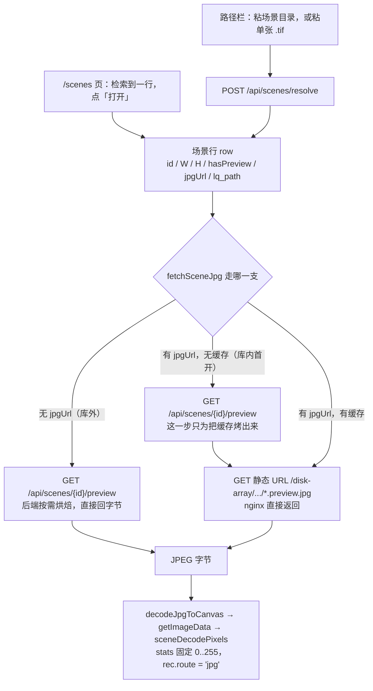
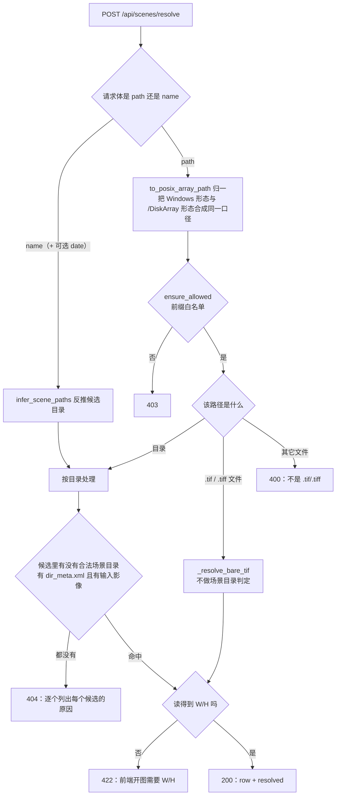
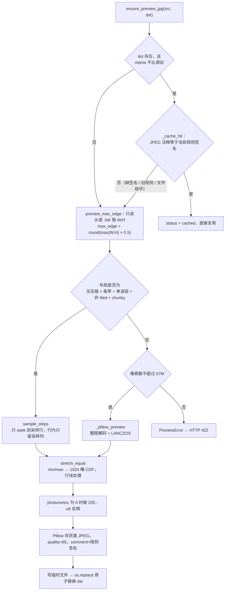

# 盘阵场景预览烘焙管线 背景知识

> 2026-09-17 / 已定
>
> **目标读者**：要改这条链路上任何一段的开发者（后端 `preview_jpg.py` / `api/app.py`，前端 `api.ts` / `stores/viewer.ts` / `stores/scenes.ts`）。
> **一句话摘要**：盘阵场景不把原始 TIF 交给浏览器，而是在源文件同目录先烤一张长宽各为 1/2、直方图均衡过的灰度 JPEG，浏览器读那张 JPEG。
> **阅读顺序**：先看 §3 的两张流程图建立整体印象，再按需读 §4 的对应小节；§5 收录了改这条链路时最容易判断错的几个点。
>
> **范围**：本文覆盖「用户给出一个盘阵路径或文件名」到「图像画到画布上」的完整链路。
> **不覆盖**：本地文件路径（`选择 TIF…` / 拖入）的 UTIF / geotiff 分块 / 稀疏条带三路分派——那条路仍然在浏览器里直接读源 TIF，与本文的烘焙产物无关，两条路的常量也不共用。

---

## 1. 一句话总结

浏览器只拿一张服务端预先烤好的 JPEG；烘焙在源文件所在目录就地完成并就地缓存，缓存是否可复用由写在 JPEG 注释里的**规则签名**决定，不由修改时间决定。

---

## 2. 需要的背景概念（按重要程度排列）

### 2.1 为什么浏览器不能直接读盘阵原始 TIF

浏览器有两项硬上限：单次 `ArrayBuffer` 分配约 2GB、Canvas 面积上限 16384²。盘阵上的真实场景是 1.1~1.8GB、2.4 万像素级，像素数据本身约 `W×H×2 ≈ 1.2GB`，转 RGBA 后约 2.4GB，两者都在上限之外。因此浏览器侧不存在「整幅解码」这个选项。

（历史方案 `HttpSource + nginx Range` 曾计划让浏览器按需 Range 读 TIF 字节，已废弃。现在盘阵路径完全不碰原始 TIF 字节。）

### 2.2 真实盘阵 TIFF 的布局

已确认的形态是：**无压缩（`compression=1`）+ 每行一条带 + 单波段**，且多数场景目录带一个 ENVI `.hdr`（含 `samples` / `lines` / `bands`）。这个布局是稀疏采样可行的前提——知道每行的条带偏移后，就能只读需要的那些行，而不必解码整幅。

不满足该布局的文件（压缩、tiled、多波段、planar≠1）走 Pillow 兜底，且只对像素数不超过 67M 的小文件开放。

### 2.3 稀疏采样的语义

目标像素 `(i, j)` 取源图 `(round(i*(H-1)/(ph-1)), round(j*(W-1)/(pw-1)))`。分子分母都用 `n-1`，即**端点对齐**：首行取首行、末行取末行。若改成 `ceil` 之类的写法，最右列/最下行会重复取样，在图上表现为边缘条纹。

缩放比 `ps = min(1, max_edge / max(W, H))`。本文这条链路传入的 `max_edge = round(max(W,H) * 0.5)`，`ps` 恒为 0.5，得到长宽各 1/2。

### 2.4 拉伸

16bit 影像值域 0~65535，屏幕只有 0~255，显示前必须把「大多数像素所在区间」映射到 0~255。

- **2% 线性**：取 2% / 98% 分位作为两端。
- **直方图均衡**：取整幅 min/max（不是分位），建 1024 桶累积直方图，按 CDF 重映射。

本链路用直方图均衡。两侧（后端 `stretch_equal`、前端 `stretchMap(mode='equal')`）是逐式镜像的两份实现，见 §4.5。

### 2.5 缓存签名

烘焙产物就地覆盖，文件名不变（`<stem>.preview.jpg`）。因此「这份缓存还符不符合当前规则」不能靠文件名区分，靠的是写在 JPEG 注释段里的一个 ASCII 串：

```
srprev:v2:half+equal:q85
        │   │          └ quality → 改 PREVIEW_JPG_QUALITY 要 bump
        │   └ 尺寸与拉伸规则
        └ 规则版本号 PREVIEW_RULE_VERSION
```

Pillow 用 `Image.save(..., comment=...)` 写、`Image.open(...).info["comment"]` 读。

---

## 3. 流程总览

### 3.1 端到端



两条入口的差别只在 row 从哪来（`GET /api/scenes` 检索 vs `POST /api/scenes/resolve`），之后的取字节与显示完全共用。

### 3.2 resolve 的分派与结果码



`name` 分支的日期可省略，由后端从文件名的 14/8 位成像时间戳里取；前端不重复实现这套正则（命名规则的唯一真源在 `backend/pathguard.py`）。

反推可能得到多个候选，逐个检查：先确认是目录，再确认 `scene_search.input_scene_path` 认得出输入影像；认不出时分别给出「缺 `dir_meta.xml`」或「目录里没有输入影像」两种原因。全部候选都不中才 404，并把每个候选的原因一并写进 `detail`——不静默换一条路径。

### 3.3 烘焙与缓存判定



---

## 4. 关键实现与设计取舍

### 4.1 场景行 row 的字段语义

同一个 row 里混着三类信息，改动时最容易弄混：

| 字段 | 含义 | 真值来源 |
|---|---|---|
| `W` / `H` | **元数据尺寸**，即源图尺寸，不是 JPEG 的像素尺寸 | `scene_dims`：优先 `.hdr`，否则 TIFF 头探测 |
| `hasPreview` | 缓存文件**此刻在不在** | `jpg_path.is_file()`。库内库外都填真值 |
| `jpgUrl` | nginx 静态 URL，**只有源在 `SR_SCENES_ROOT` 之下时才有值**；库内的库行给的是「缓存该在的位置」，文件可能还没生成 | `rel_url()` |
| `lq_path` | 提交 SR 时用的目录。**这是「能不能提交」的判据** | 见 §4.2 |
| `sr_capable` | 与 `lq_path` 同源同真假的显式标志 | 见 §4.2 |

要点：`jpgUrl` 有值不等于缓存已存在，所以前端判断「这次会不会触发烘焙」用的是 `hasPreview`，不是 `jpgUrl` 是否为空。

源文件本身就是 `.jpg/.jpeg` 时（盘阵里的显示就绪图），不烘焙：`hasPreview` 恒真、`jpgUrl` 直接指向源文件，`/preview` 也直接回该文件。

### 4.2 裸 `.tif` 入口与「能不能提交 SR」

路径栏接受单张 `.tif` 文件。这类输入只保证「能看」，不保证「能提交 SR」，两者必须显式分开：

- 目录分支走到 200 时，已经确认过有 `dir_meta.xml` 且目录里有输入影像，所以 `sr_capable` 恒为真。
- 裸 `.tif` 分支不做任何场景目录判定。只有当**父目录恰好是合法场景目录、且该目录的输入影像就是这个文件**时（逐项比对用 `os.path.samefile`，因为 Windows 上 `Path.__eq__` 是大小写敏感的字符串比较，会把小写盘符判成不同文件），`sr_capable` 才为真；否则 `sr_capable = false`、`row.lq_path = null`、`resolved.mask_path = null`。

前端据此决定：`lqPath` 为空时不写进 rec，文件列表里「提交 SR」保持禁用，并给出提示。这条判断在 `stores/viewer.ts` 里还有一处配套约束——`tryLinkScenes` 对 `route === 'jpg'` 的 rec 直接早退，不再按文件名反推目录。原因是裸 `.tif` 的父目录可能不是场景目录，按文件名反推有命中**另一个**目录的可能，那会让用户拿着错的 `lq_path` 去跑 SR。

### 4.3 取字节的两条路

- **库外（裸 `.tif`）**：没有可以映射成静态 URL 的位置，走 `GET /api/scenes/{id}/preview`，后端烘焙完直接 `FileResponse` 回字节。
- **库内**：优先走 nginx 静态 URL `/disk-array/.../*.preview.jpg`，由 nginx 原生缓存承担重复请求。缓存尚未生成时，先打一次 `/preview` 把它烤出来，再取静态 URL——这一步是必须的，因为 nginx 不会去触发后端生成。

场景 id 有两种形态，靠前缀区分：库行是 `base64url(rel)`，手工行（resolve 出来的）是 `~` + `base64url(绝对路径)`。后者经 pathguard 的前缀白名单校验，`..`、白名单外的绝对路径、非绝对路径一律拒绝。

### 4.4 烘焙的尺寸、采样与并行

尺寸：`max_edge = max(1, round(max(W, H) * PREVIEW_SCALE))`，`PREVIEW_SCALE = 0.5`。缩放比仍走原来的 `ps = min(1, max_edge / max(W,H))` 公式，采样算法本身没有改动——换规则只改了 `max_edge` 的算法。不封顶，因此 24739×24199 → 12370×12100。

采样：`sample_strips` 按 `row_idx` 逐行读，每行只 `seek` 到该行的条带偏移、只保留 `col_idx` 指定的列。1/2 采样下恰好读到源文件一半的字节，这是几种读法里读得最少的：块读、`memmap`、整文件顺序读都会多读一倍。

并行：仅当采样行数 ≥ `PARALLEL_MIN_ROWS`（512）时才并行，避免小图上线程开销盖过收益（也让小 fixture 的测试结果确定）。并行度 `READ_THREADS = 8`。

两个实现约束：

- **每段开自己的文件句柄**。线程之间不能共享句柄，因为 seek 位置是句柄状态，而 Windows 没有 `os.pread`——这是唯一可移植的并行读法。
- **必须消费 `ex.map` 的返回值**。异常在线程里抛出，只有迭代时才转交给调用方；不消费就等于静默吞掉。

这条并行为延迟而非带宽优化：1/2 尺度要发约 1.2 万次读，盘阵上单次读若有毫秒级延迟，串行就是十几秒；8 路并发把它压回一秒量级。页缓存命中时收益只有约 1.4 倍，所以开发机上几乎量不出效果。

### 4.5 拉伸：直方图均衡与前后端逐式对齐

`stretch_equal` 逐式镜像前端 `computeStats` + `stretchMap(mode='equal')`：

```
lo, hi = min/max(有限值)                    # 是 min/max，不是 p2/p98
若 hi <= lo: 全零图 → 0，其它常量图 → 128
BINS = 1024
直方图入桶:  q = ((v - lo) * BINS / (hi - lo)) | 0        # 对应 computeStats
查表下标:    k = ((v - lo) / (hi - lo) * (BINS - 1)) | 0  # 对应 stretchMap
out = cdf[k] / total * 255
```

两处公式**故意不同**（一个用 `BINS`、一个用 `BINS - 1`），这是前端既有实现的原样，不要在任一端把它们「顺手统一」。

三个必须保留的实现细节：

- **按行块处理**（`_STRETCH_CHUNK = 4M px`）。1/2 尺度下输出有约 1.5 亿像素，整图 `astype(np.float64)` 会产生 1.2GB 副本；分块后额外峰值约 32MB。
- **`np.rint` 而非 `astype(np.uint8)`**。前端把结果写进 `Uint8ClampedArray`，那是四舍五入（ties-to-even）；`astype` 是截断，会整体差 1 个灰阶。
- **NaN 落到 0 号桶**。前端 `(NaN * n) | 0` 得到 0，这里用 `np.nan_to_num` 对齐。

`photometric == 0`（WhiteIsZero）在查表之后做 `255 - u8` 反相，与前端 `stretchRgba` 的先反色一致。

### 4.6 缓存失效：规则签名优先于 mtime

`ensure_preview_jpg` 的命中需要两条**同时**成立：产物不比源旧，且签名等于当前规则。只判 mtime 会在换包后失效——升级前烤的图 mtime 就是比源新，只看 mtime 会把它判为有效而永不重烤，用户看不到任何变化。

签名由 `rule_stamp()` 生成，`PREVIEW_RULE_VERSION` 与 `PREVIEW_JPG_QUALITY` 都是它的一部分。**改动尺寸、拉伸或质量中的任何一项，都要 bump 对应的部分**，否则旧缓存不会失效。

一个相关的坑：Pillow 默认 `MAX_IMAGE_PIXELS` 是 8948 万，超过 2 倍直接抛 `DecompressionBombError`。1/2 尺度下 2.4 万像素级的源烤出来正好是 1.5 亿像素，会让 `_cache_hit` 里的 `Image.open` 抛异常、缓存永远判不中，于是每次打开都重烤。本模块把它提到 `1 << 30`（约 10.7 亿，仍能挡住声明 21 亿像素以上的文件）。

### 4.7 显示层

`openSceneJpg` 拿到 JPEG 字节后：`decodeJpgToCanvas` 解码 → `getImageData` → `sceneDecodePixels`。后者用 `computeStats(src, tw, th, 1, 0, 255)`，把 stats 固定成 0..255——这样 `linear` 拉伸是恒等映射，在 `linear` 模式下看到的就是服务器烤的那份像素。

rec 的 `route` 记为 `'jpg'`，`layout` 记为「盘阵 JPG（1/2 尺度 + 直方图均衡，服务端已烘焙）」。

起手拉伸为 `SCENE_START_STRETCH = 'equal'`。由于底图已经均衡过，这一步是**再均衡一次**，灰度分布已近似均匀，基本是恒等映射。这个常量与本地图的工具栏模式解耦，只影响某张图**首次**绘制（之后以 `rec.paintedMode` 为准）。

掩码与 ROI 的坐标换算走的是**元数据 `W`/`H`**，不是 JPEG 的像素尺寸（`thumbPolysToOrig` 的 scale 取自元数据）。因此烘焙尺寸变化不影响掩码落点。

### 4.8 落点与原子写

落点有**三种**（2026-09-18 起）。前两种是长期缓存，由 `preview_jpg_for` 决定；第三种是拖拽入口的临时缓存，由 `preview_cache.tmp_preview_path` 决定：

- 源在 `SR_SCENES_ROOT` 之下 → `preview_jpg_path`：默认 `<源同目录>/<stem>.preview.jpg`；若配了 `SR_PREVIEWS_ROOT`（必须在 scenes root 之下，否则 nginx 单根 alias 覆盖不到）则搬到 `<previews_root>/<rel 目录>/<stem>.preview.jpg`，URL 不变。
- 源在库外（粘路径 / 裸 `.tif` 打开）→ 恒为 `<源同目录>/<stem>.preview.jpg`。这类不走 nginx 静态 URL，不需要在 URL 层面可映射。
- **拖拽入口**（`GET /api/scenes/{id}/preview-tmp`）→ `SR_TEMP_PREVIEWS_ROOT/<YYYY-MM-DD>/<sha256(源绝对路径)[:16]>.jpg`。烘焙规则与前两种完全相同（同一份 `ensure_preview_jpg`），差别只在落点与生命周期：按日期分桶、每天 0 点整桶删（`preview_cache.purge_temp_previews`，由 `api/app.py` 的后台任务 `_tmp_preview_purge_loop` 驱动），源目录一个字节都不写。响应带 `Cache-Control: no-store`。

为什么拖拽那份要单独走：拖进来的源可能是盘阵上**任意**一张图，往生产数据目录里撒缓存文件不可接受；而它又不需要长期保留（同一张图第二天重新打开，重烤一次即可）。清理只删「桶名是 ISO 日期、且桶里带 `.sr-tmp-preview` 标记文件」的目录 —— 标记文件把「这个目录是我们建的」变成可判定的事实，比任何路径白名单都可靠。

写盘走「临时文件 → `os.replace`」：`os.replace` 在 POSIX 与 Windows 上都是原子替换，读者不会读到半个文件。临时文件建在目标同目录（`tempfile.mkstemp` 的 `dir`），保证与目标同一文件系统。

---

## 5. 常见问题

**Q：为什么缓存判定要读 JPEG 注释，不能只比尺寸？**
比尺寸判不出拉伸规则的变化；而且长边恰好为 16384 的图两种规则烤出的尺寸相同。注释签名把尺寸、拉伸、质量三者一起覆盖了。

**Q：`hasPreview` 为什么库外也要填真值？**
库外用不上静态 URL，但前端要靠它判断「这次会不会触发烘焙」并提示用户等待。若因为「用不上」就一律留 false，第二次打开会重复提示。

**Q：改了烘焙规则，需要清理盘阵上的旧缓存吗？**
不需要。旧图没有新签名，首次打开时会被判定失效并原地重烤。代价是每张图在升级后第一次打开会慢一次。注意 nginx 给 `.preview.jpg` 配了 `max-age=3600`，浏览器可能在一小时内继续用旧图，硬刷新一次即可。

**Q：`/preview` 返回的尺寸和 `row.W/H` 不一致，是 bug 吗？**
不是。`row.W/H` 是元数据尺寸（源图尺寸），JPEG 是各边 1/2。前端按元数据换算掩码坐标正是依赖这一点。

**Q：拖拽入口的临时缓存为什么要每天重烤一次？**
因为它按设计只活一天：桶在第二天 0 点整桶删除，之后打开同一张图会重新烤。代价是每天第一次拖会出现一次几十秒的等待；换来的是「不往生产数据目录撒缓存文件」+「缓存占用有上界（只有当天那一桶）」。长期缓存（场景库 / 粘路径）不受影响，仍然跟着场景数据长期存在。

**Q：拖拽命中为什么需要「文件名 + 字节数」两个指纹？**
同一个场景目录里可能躺着不止一张图：RC 场景的输入影像是 `PAN.tif`，而 `input_scene_path` 的候选次序是 `<目录名>.tif` 在前，返回的是它。只比字节数，用户拖进来的可能是一张**不是 SR 实际会读**的影像，那之后画的掩码坐标会整片落在别的图上。判定在服务端（`_fingerprint_mismatch`），对不上就 404 + 列出原因，前端退回浏览器本地解码。

**Q：拖拽命中之后，本地文件那条解码还跑吗？**
不跑。`viewer.activate` 先 `await tryLinkScenes(rec)`，命中就直接返回 —— 真机上一次全图解码几十秒、几百 MB，而服务端那份预览已经在手上。也顺带避开了「本地图先画出来、几百毫秒后又被 JPG 换掉」的闪烁。没命中才走本地解码。

**Q：什么时候会走 Pillow 兜底？**
采样器判定布局不支持（压缩、tiled、多波段、planar≠1）时。兜底只对像素数 ≤ 67M 的文件开放，因为 Pillow 会整图解码，1.1GB 的场景会直接打爆内存。超过 67M 的不支持布局会以 `PreviewError` 上报 422，而不是勉强解码。

**Q：并行读为什么是 8 路？**
盘阵若是单块 HDD，磁头竞争可能让更高并发反而更慢，因此取了保守值。这个数字同时受「盘阵实际存储形态」影响，属于需要在真机上确认的项。

**Q：这条链路的常量与浏览器侧的 8192 是什么关系？**
无关，是两条独立的路。`SPARSE_PREVIEW_MAX` / `JPG_MAX` / 导出降档用的 `_exportCap` 属于本地文件路径的浏览器侧预览与导出，仍然适用 8192 长边；本文这条路的尺寸由 `PREVIEW_SCALE` 决定，不受那组常量影响。

---

## 相关文档

- [docs/status/current-question.md](../status/current-question.md) —— 交接入口，§4 记录了烘焙规则 v2 的六项决策与验证数据
- [docs/experience/gui-experience.md](../experience/gui-experience.md) —— §9 与 §9.1 收录了这条链路改版时遇到的具体问题
- [docs/planning/api-contract.md](../planning/api-contract.md) —— §3.5 是场景接口的契约描述
- [docs/knowledge/jpg-export-background.md](jpg-export-background.md) —— 浏览器侧的 JPG 导出，与本文的产物是两回事
- [docs/knowledge/platform-tutorial.md](platform-tutorial.md) —— §7 从架构角度说明盘阵场景为何改为读服务端 JPG
